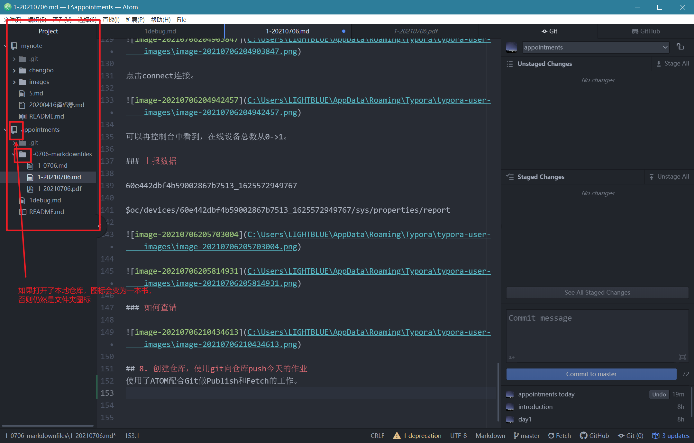

# 作业1-2021/7/6

## 1. UDP测试数据（学号2018080405）

## 2. TCP测试数据（学号2018080405）

## 3. MQTT 主题（fudingyi） 测试数据2018080405

## 4. 串口调试软件中保存的命令

## 5. 利用云服务完成BC26之间的通信

## 6. 华为IoTDA

### 1.向导式极速体验

---

### 2.使用虚拟设备体验

#### 创建产品

创建产品成功的窗口。

#### 开发产品模型

#### 注册虚拟设备

使用在线调试功能，注册一个虚拟设备用于调试。

#### 数据上报

#### 命令下发

## 7. MQTT.fx

查看设备接入信息，记录域名和端口。

### 连接鉴权

使用MQTT.fx工具接入物联网平台。

1. 安装；

2. 填写设备这侧后生成的设备ID（Device）和密钥（DeviceSecret），生成连接信息（ClientID、Username、Password）

   

Broker address 121.36.42.100

Broker Port 1883

然后点击Apply。

点击connect连接。

可以再控制台中看到，在线设备总数从0->1。

### 上报数据

60e442dbf4b59002867b7513_1625572949767

$oc/devices/60e442dbf4b59002867b7513_1625572949767/sys/properties/report

### 如何查错

## 8. 创建仓库，使用git向仓库push今天的作业
使用了ATOM配合Git做Publish和Fetch的工作。

 
