# day2记录
## Node.js和Node red安装
### 1.Node red在WindowsPowerShell下的安装
1. 在安装完Node.js之后，在PowerShell之中执行node-red

> node-red

Restricted策略带来的无法执行脚本的问题
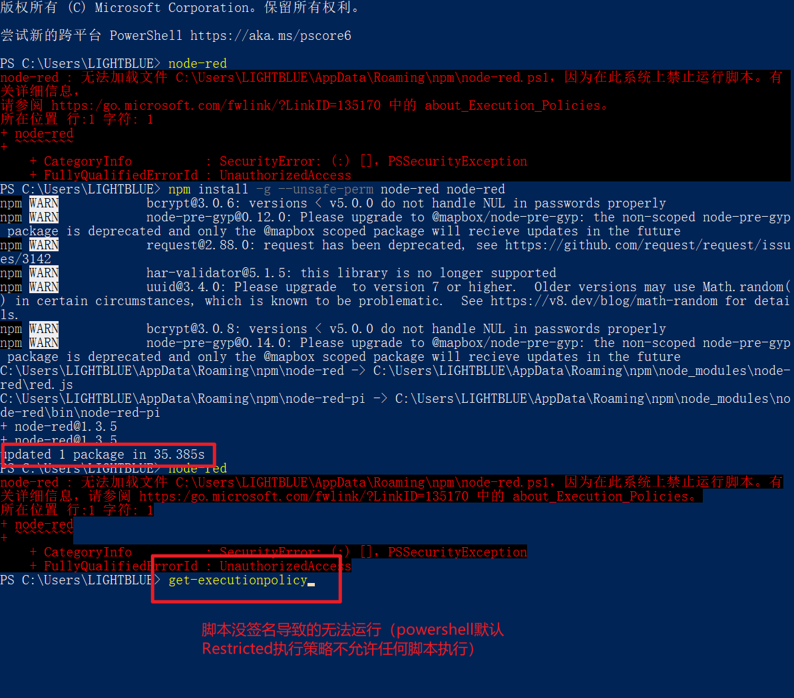

> get-executionpolicy

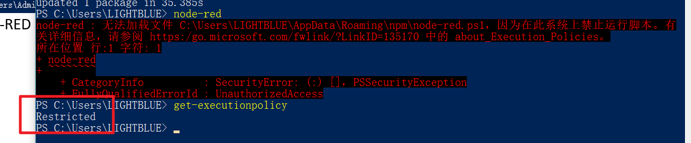
> set-executionpolicy remotesigned
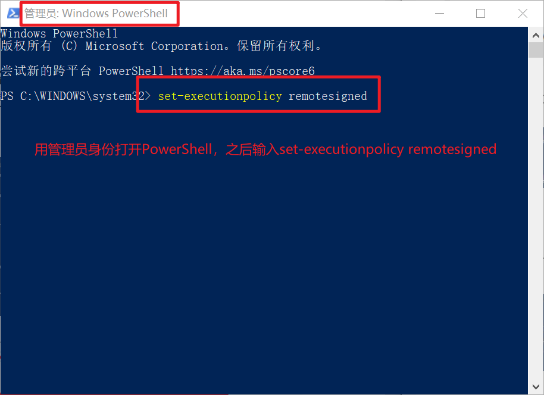
之后在选择中输入Y即可。

重新打开WindowsPowerShell，再次输入'node-red'。安装成功的node-red会出现Welcome信息。

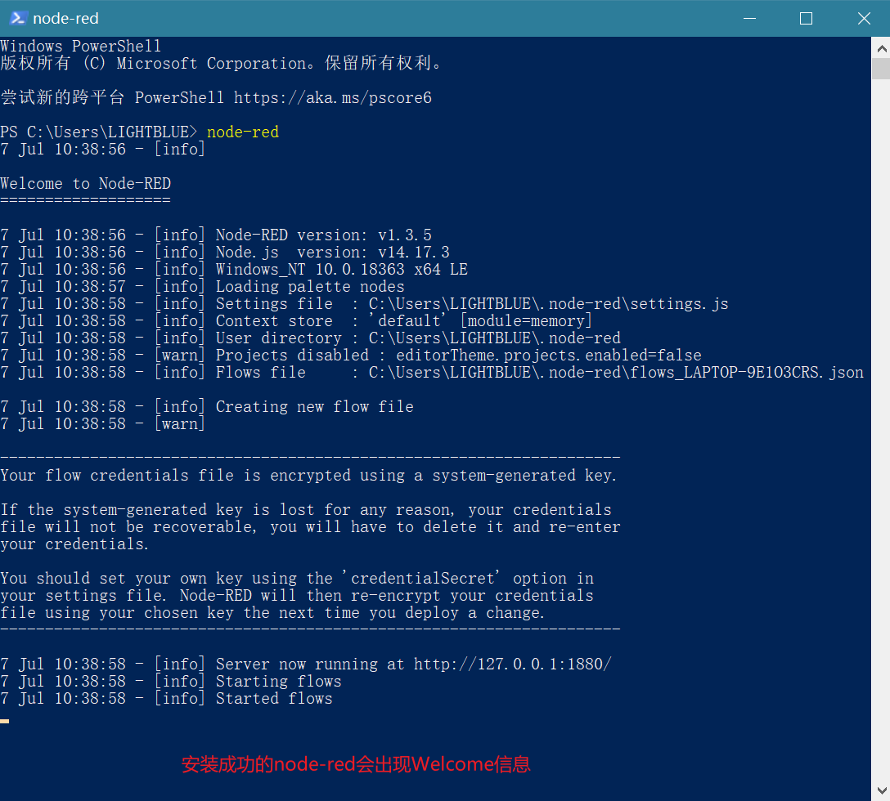

将其服务器地址输入至Google Chome之中：

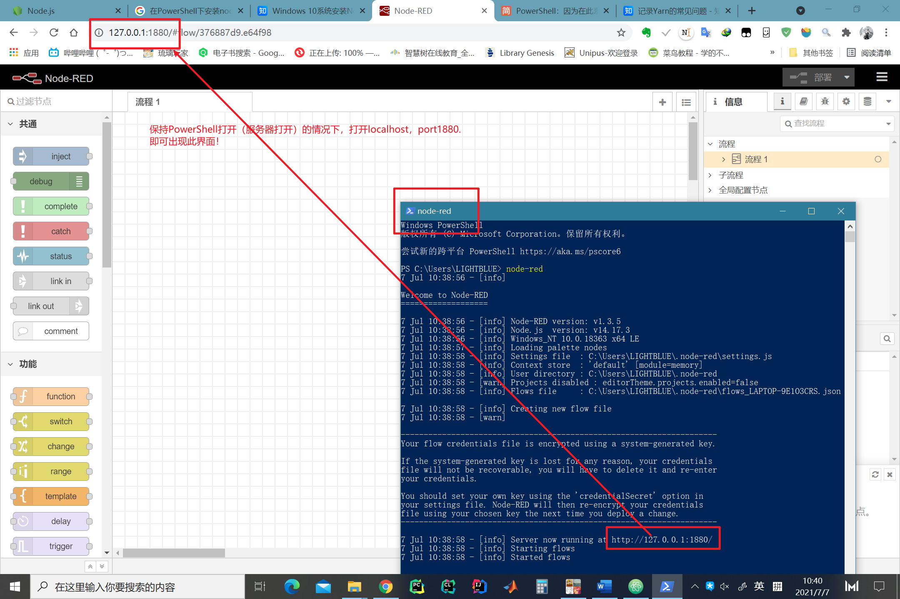

会出现Node-RED界面。

注意：

- 此时不可以关闭WindowsPowerShell：
    - 关闭WindowsPowerShell相当于关闭了Server
- 也可以用localhost:1880的方式接入
## 2.虚拟串口配置
将10和11连接起来
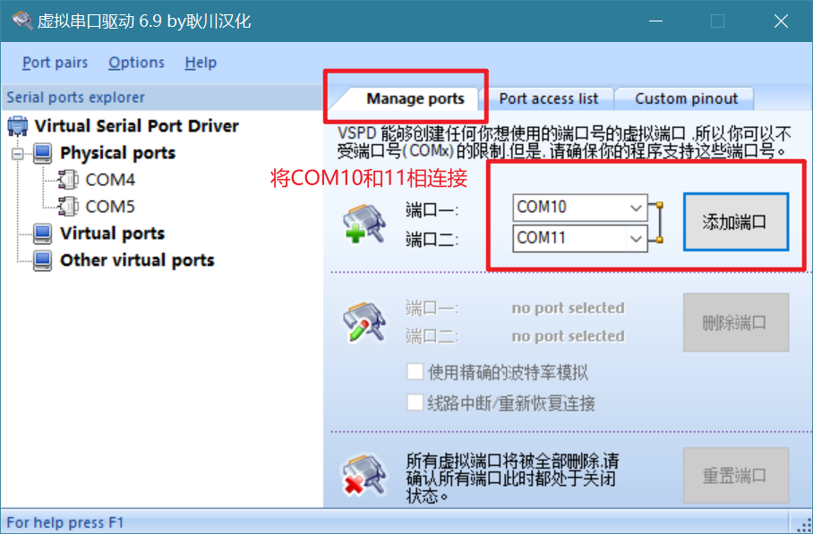
## 3.直接hello world

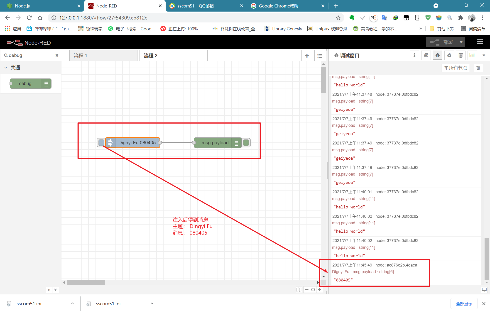
## 4.利用COM10和11

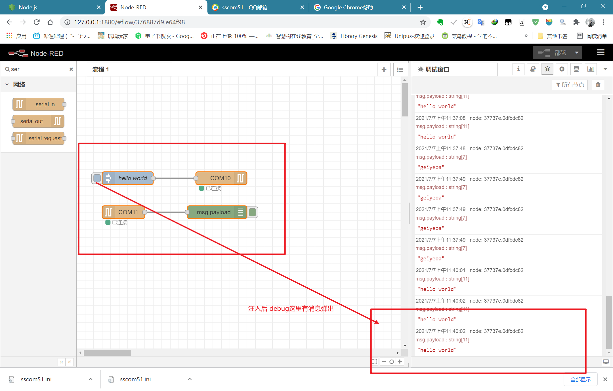

注意：
- 出现未连接字样：
    - 可能是其他程序占用了端口。可以在虚拟串口配置的软件里具体看到COM的打开或关闭，哪个程序占用了COM。

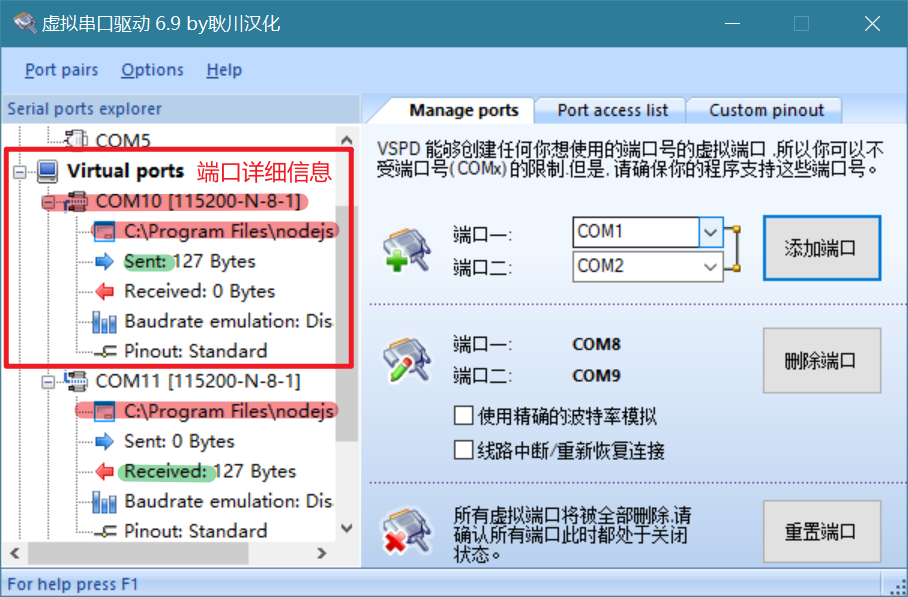

## 5.tips today
### 1. sscom
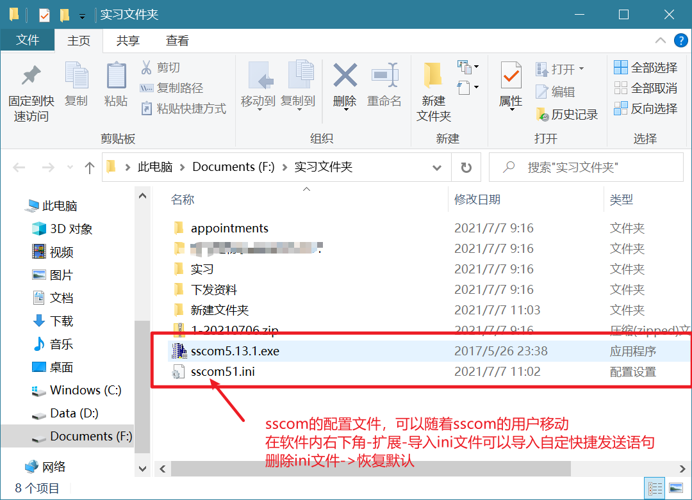

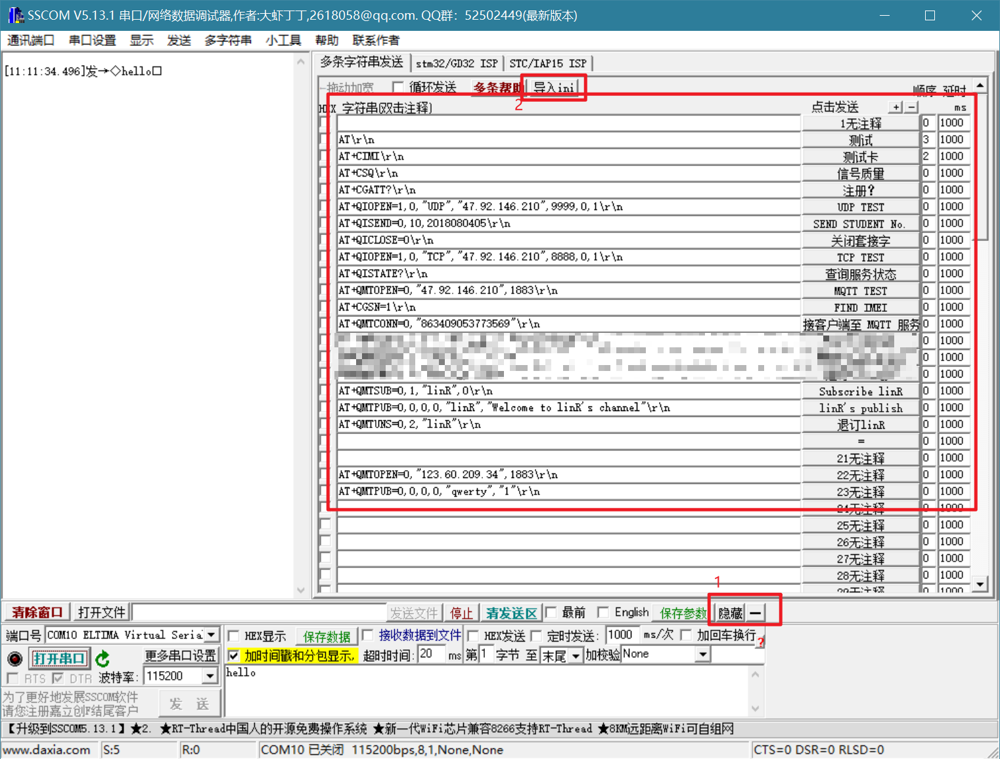
