# day3

## 工作总结

### 作业点评

1.  格式问题 格式规范

    1.  图片放到中间去

    2.  可以提交pdf，以防止格式的改变

    3.  截图之中要有解释

    4.  要加说明

2.  建议写blog 可以做知识的积累

### 上课请假与上课时长问题

-   找徐老师请假

-   挂着 别退

### ocam和snipaste的使用

-   ocam录屏工具

-   今天的东西的录屏讲解

### 今天的小组工作

-   **烟感**

### 例会

### 华为云服务器上部署Node-RED

## 烟感Node-RED实现

### 演示视频

-   录制演示视频

### 讨论项目

-   智能家居

-   与`MQTT`联合工作

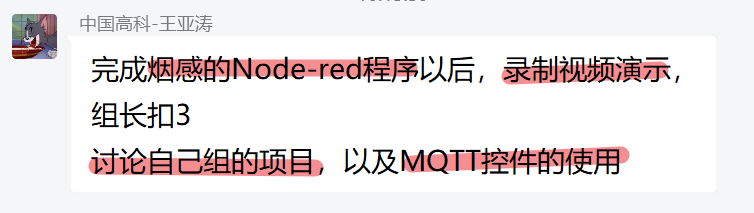

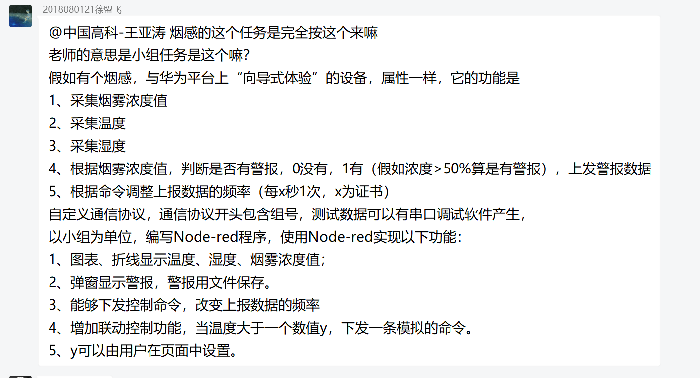

## 工作日志

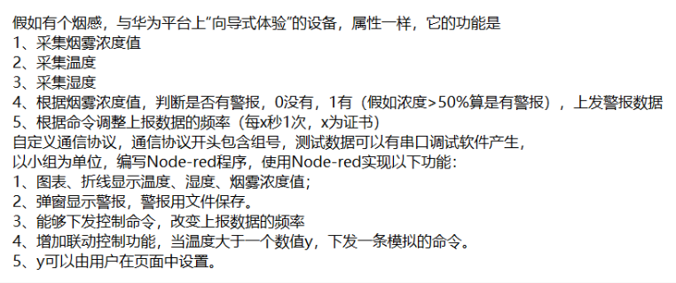

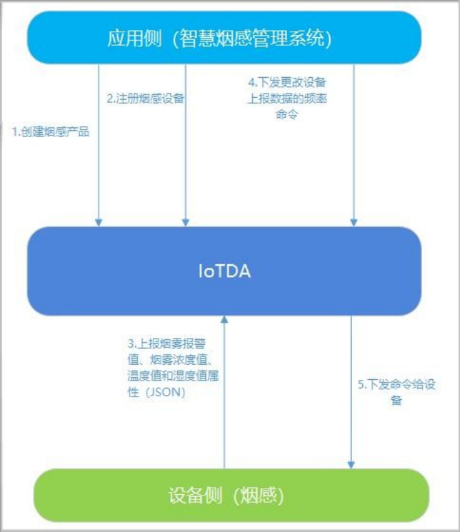

### Node-RED上的实现

#### Javascript的小问题

[How to Add element to
msg.payload](https://discourse.nodered.org/t/how-to-add-element-to-msg-payload/3361)

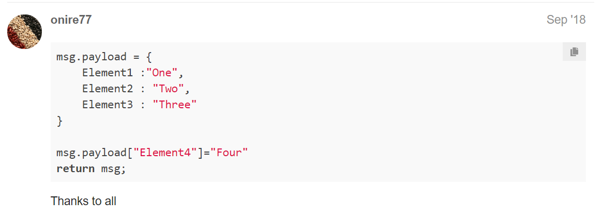

#### inject模拟注入mqtt传来的msg

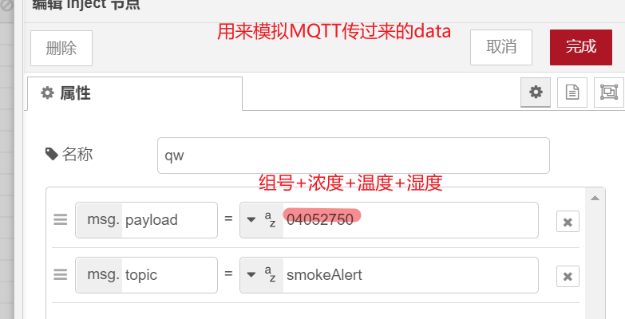

#### string分割

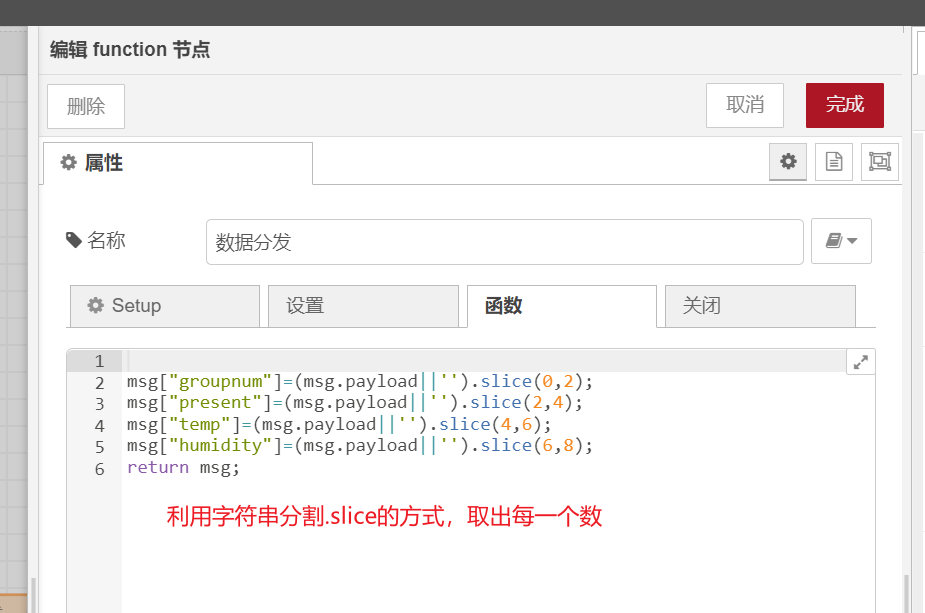

#### string转换成Int

\#\#\#\#\#基本思想

1.  把长字符串分割

2.  提取出上传的数据

3.  字符串转成Int方便后续操作

    1.  多输出端口

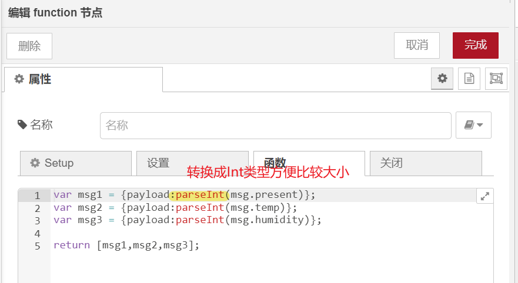

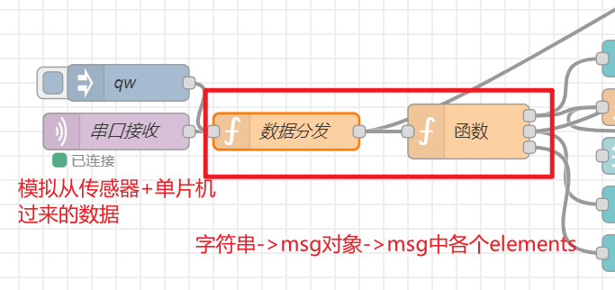

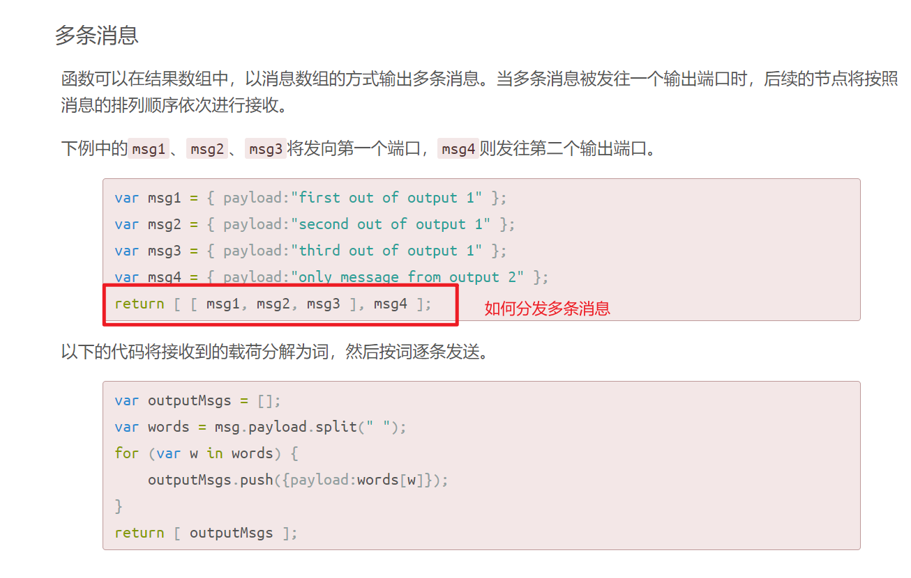

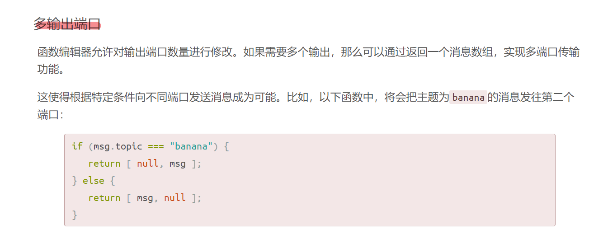

##### parseInt()

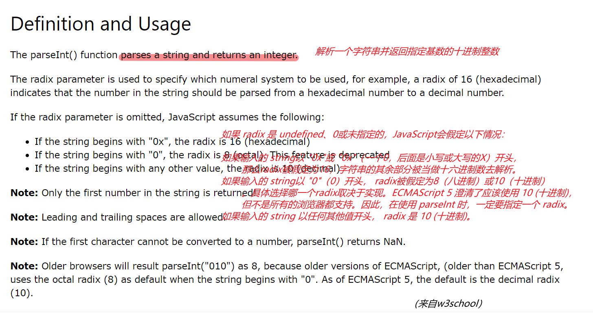

#### dashboard部分

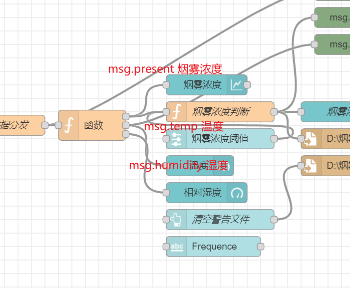

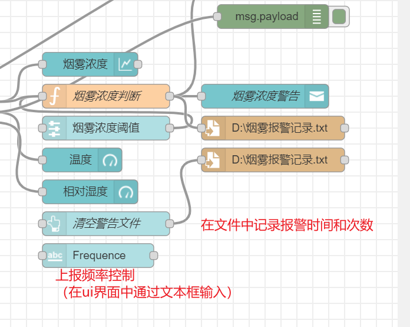

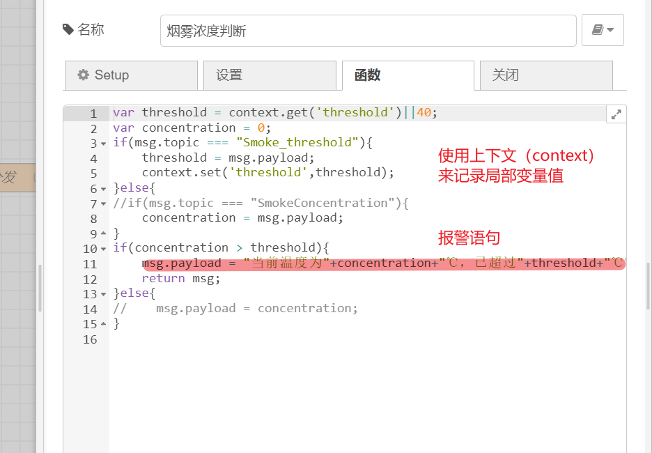

##### ui界面

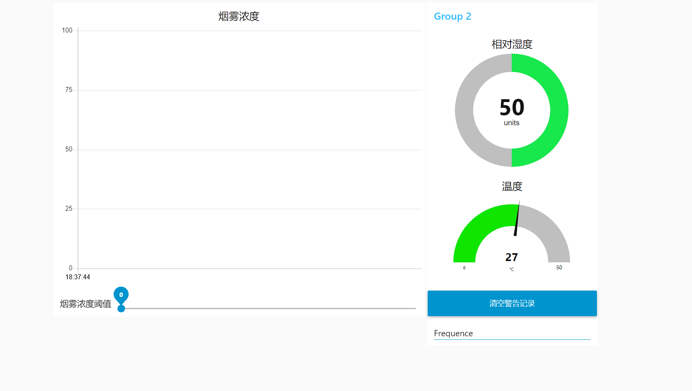

#### 改进

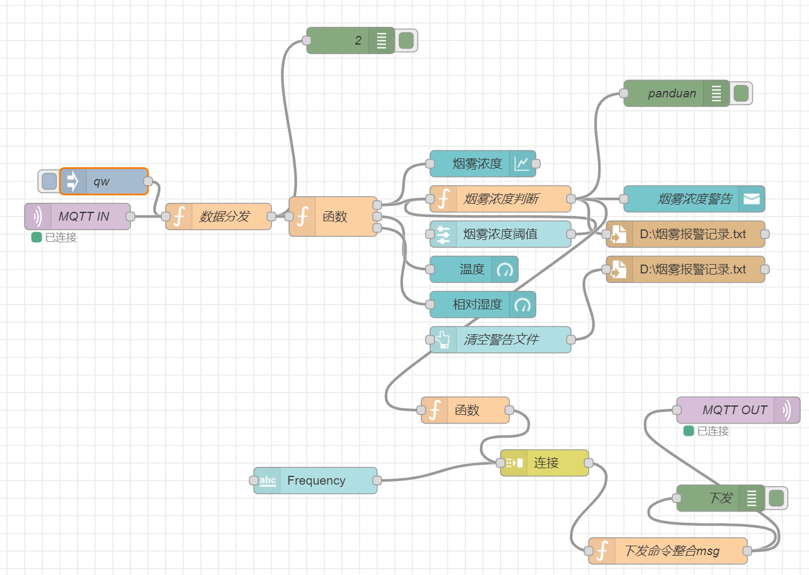

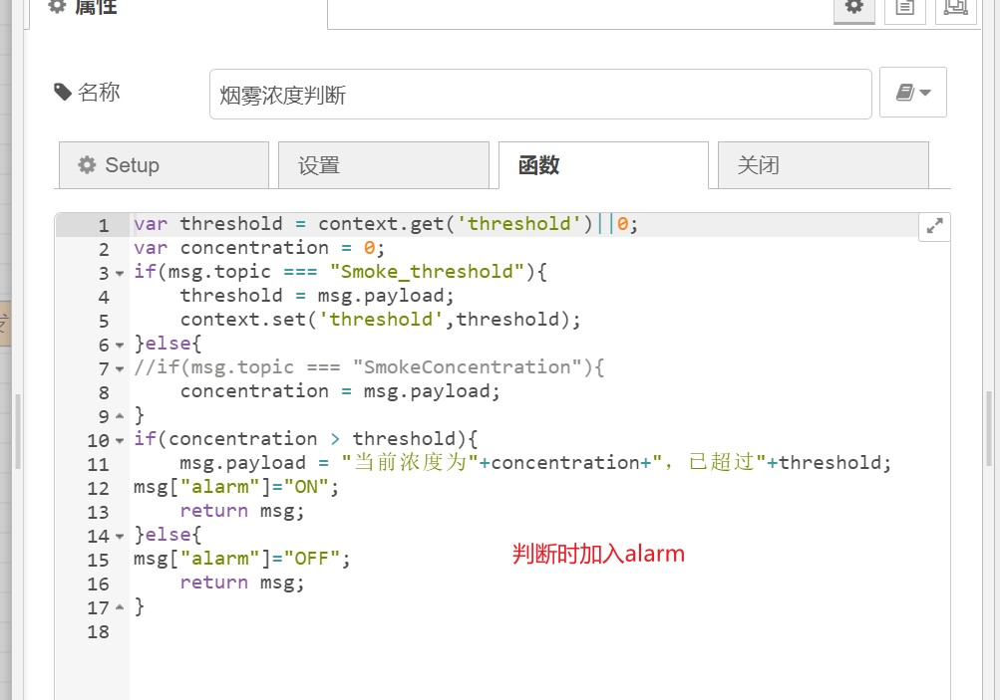

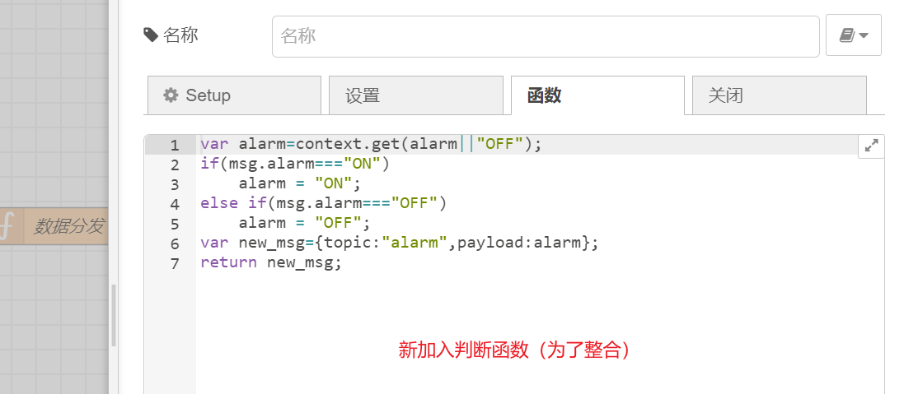

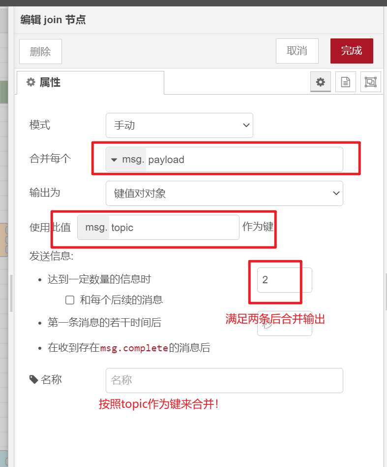

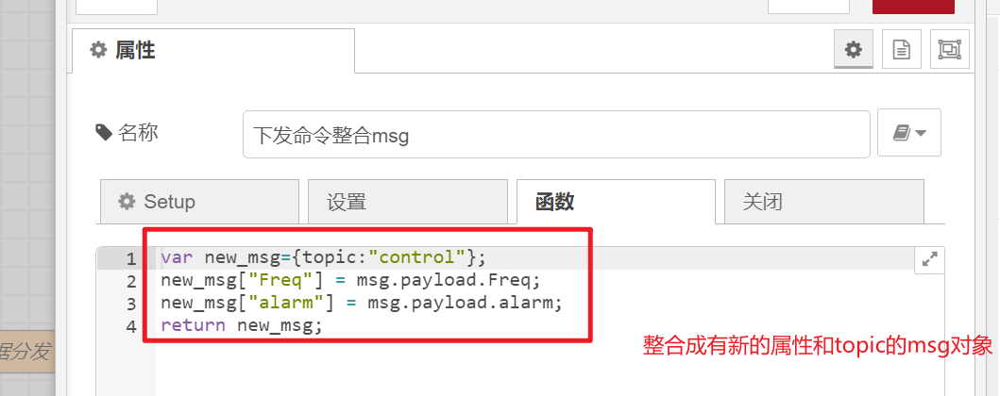

#### 流程

~~~~~~~~~~~~~~~~~~~~~~~~~~~~~~~~~~~~~~~~~~~~~~~~~~~~~~~~~~~~~~~~~~~~~~~~~~~ JSON
[
    {
        "id": "5b3fa26a.78c54c",
        "type": "ui_gauge",
        "z": "b7cd5b25.0ecd88",
        "name": "",
        "group": "b4f7fa80.272ca8",
        "order": 1,
        "width": 0,
        "height": 0,
        "gtype": "donut",
        "title": "相对湿度",
        "label": "units",
        "format": "{{value}}",
        "min": 0,
        "max": "100",
        "colors": [
            "#edfa3d",
            "#17e84b",
            "#ca3838"
        ],
        "seg1": "35",
        "seg2": "65",
        "x": 640,
        "y": 380,
        "wires": []
    },
    {
        "id": "a07f0972.6a14f8",
        "type": "ui_gauge",
        "z": "b7cd5b25.0ecd88",
        "name": "",
        "group": "b4f7fa80.272ca8",
        "order": 2,
        "width": 0,
        "height": 0,
        "gtype": "gage",
        "title": "温度",
        "label": "℃",
        "format": "{{value}}",
        "min": "0",
        "max": "50",
        "colors": [
            "#3187e3",
            "#0fe600",
            "#ee5353"
        ],
        "seg1": "18",
        "seg2": "28",
        "x": 630,
        "y": 340,
        "wires": []
    },
    {
        "id": "6f8e1b2a.2e0d54",
        "type": "ui_chart",
        "z": "b7cd5b25.0ecd88",
        "name": "",
        "group": "2d907a5e.2824e6",
        "order": 1,
        "width": "13",
        "height": "10",
        "label": "烟雾浓度",
        "chartType": "line",
        "legend": "false",
        "xformat": "HH:mm:ss",
        "interpolate": "linear",
        "nodata": "",
        "dot": false,
        "ymin": "0",
        "ymax": "100",
        "removeOlder": "2",
        "removeOlderPoints": "",
        "removeOlderUnit": "60",
        "cutout": 0,
        "useOneColor": false,
        "useUTC": false,
        "colors": [
            "#1f77b4",
            "#aec7e8",
            "#ff7f0e",
            "#2ca02c",
            "#98df8a",
            "#d62728",
            "#ff9896",
            "#9467bd",
            "#c5b0d5"
        ],
        "outputs": 1,
        "useDifferentColor": false,
        "x": 640,
        "y": 220,
        "wires": [
            []
        ]
    },
    {
        "id": "d666c1be.421c1",
        "type": "ui_slider",
        "z": "b7cd5b25.0ecd88",
        "name": "",
        "label": "烟雾浓度阈值",
        "tooltip": "",
        "group": "2d907a5e.2824e6",
        "order": 2,
        "width": 0,
        "height": 0,
        "passthru": true,
        "outs": "end",
        "topic": "Smoke_threshold",
        "topicType": "str",
        "min": 0,
        "max": "100",
        "step": 1,
        "x": 660,
        "y": 300,
        "wires": [
            [
                "cabd8c5e.359ad"
            ]
        ]
    },
    {
        "id": "33db1307.7e501c",
        "type": "ui_toast",
        "z": "b7cd5b25.0ecd88",
        "position": "top right",
        "displayTime": "1",
        "highlight": "",
        "sendall": true,
        "outputs": 0,
        "ok": "OK",
        "cancel": "",
        "raw": false,
        "topic": "",
        "name": "烟雾浓度警告",
        "x": 880,
        "y": 260,
        "wires": []
    },
    {
        "id": "cabd8c5e.359ad",
        "type": "function",
        "z": "b7cd5b25.0ecd88",
        "name": "烟雾浓度判断",
        "func": "var threshold = context.get('threshold')||0;\nvar concentration = 0; \nif(msg.topic === \"Smoke_threshold\"){\n    threshold = msg.payload;\n    context.set('threshold',threshold);\n}else{\n//if(msg.topic === \"SmokeConcentration\"){\n    concentration = msg.payload; \n}\nif(concentration > threshold){\n    msg.payload = \"当前浓度为\"+concentration+\"，已超过\"+threshold;\nmsg[\"alarm\"]=\"ON\";\n    return msg;\n}else{\nmsg[\"alarm\"]=\"OFF\";\n    return msg;\n}\n",
        "outputs": 1,
        "noerr": 0,
        "initialize": "",
        "finalize": "",
        "libs": [],
        "x": 660,
        "y": 260,
        "wires": [
            [
                "33db1307.7e501c",
                "969c9943.5aaf38",
                "f72ae5fc.70f8d8",
                "28e4dda3.db9812"
            ]
        ]
    },
    {
        "id": "28e4dda3.db9812",
        "type": "debug",
        "z": "b7cd5b25.0ecd88",
        "name": "panduan",
        "active": true,
        "tosidebar": true,
        "console": false,
        "tostatus": false,
        "complete": "true",
        "targetType": "full",
        "statusVal": "",
        "statusType": "auto",
        "x": 860,
        "y": 140,
        "wires": []
    },
    {
        "id": "7625fcb.6f9bc04",
        "type": "mqtt in",
        "z": "b7cd5b25.0ecd88",
        "name": "MQTT IN",
        "topic": "LL",
        "qos": "2",
        "datatype": "auto",
        "broker": "e32bd5ee.292208",
        "nl": false,
        "rap": true,
        "rh": 0,
        "x": 180,
        "y": 280,
        "wires": [
            [
                "cf1035c1.5e3098"
            ]
        ]
    },
    {
        "id": "cf1035c1.5e3098",
        "type": "function",
        "z": "b7cd5b25.0ecd88",
        "name": "数据分发",
        "func": "\nmsg[\"groupnum\"]=(msg.payload||'').slice(0,2);\nmsg[\"present\"]=(msg.payload||'').slice(2,4);\nmsg[\"temp\"]=(msg.payload||'').slice(4,6);\nmsg[\"humidity\"]=(msg.payload||'').slice(6,8);\nmsg[\"alarm\"]=\"OFF\";\nreturn msg;",
        "outputs": 1,
        "noerr": 0,
        "initialize": "",
        "finalize": "",
        "libs": [],
        "x": 340,
        "y": 280,
        "wires": [
            [
                "1a31d7a5.6d8168",
                "95aca985.d11868"
            ]
        ]
    },
    {
        "id": "1a31d7a5.6d8168",
        "type": "debug",
        "z": "b7cd5b25.0ecd88",
        "name": "2",
        "active": true,
        "tosidebar": true,
        "console": false,
        "tostatus": false,
        "complete": "true",
        "targetType": "full",
        "statusVal": "",
        "statusType": "auto",
        "x": 490,
        "y": 80,
        "wires": []
    },
    {
        "id": "4d2e3730.d25148",
        "type": "inject",
        "z": "b7cd5b25.0ecd88",
        "name": "qw",
        "props": [
            {
                "p": "payload"
            },
            {
                "p": "topic",
                "vt": "str"
            }
        ],
        "repeat": "",
        "crontab": "",
        "once": false,
        "onceDelay": 0.1,
        "topic": "smokeAlert",
        "payload": "04112750",
        "payloadType": "str",
        "x": 210,
        "y": 240,
        "wires": [
            [
                "cf1035c1.5e3098"
            ]
        ]
    },
    {
        "id": "95aca985.d11868",
        "type": "function",
        "z": "b7cd5b25.0ecd88",
        "name": "",
        "func": "var msg1 = {payload:parseInt(msg.present)};\nvar msg2 = {payload:parseInt(msg.temp)};\nvar msg3 = {payload:parseInt(msg.humidity)};\n\nreturn [msg1,msg2,msg3];",
        "outputs": 3,
        "noerr": 0,
        "initialize": "",
        "finalize": "",
        "libs": [],
        "x": 470,
        "y": 280,
        "wires": [
            [
                "6f8e1b2a.2e0d54",
                "cabd8c5e.359ad"
            ],
            [
                "a07f0972.6a14f8"
            ],
            [
                "5b3fa26a.78c54c"
            ]
        ]
    },
    {
        "id": "a2488ef5.f2afb",
        "type": "ui_text_input",
        "z": "b7cd5b25.0ecd88",
        "name": "",
        "label": "Frequency",
        "tooltip": "单位：次/min",
        "group": "b4f7fa80.272ca8",
        "order": 4,
        "width": 0,
        "height": 0,
        "passthru": true,
        "mode": "text",
        "delay": "100",
        "topic": "Freq",
        "topicType": "str",
        "x": 450,
        "y": 580,
        "wires": [
            [
                "50378dd.ff7df74"
            ]
        ]
    },
    {
        "id": "969c9943.5aaf38",
        "type": "file",
        "z": "b7cd5b25.0ecd88",
        "name": "",
        "filename": "D:\\烟雾报警记录.txt",
        "appendNewline": true,
        "createDir": true,
        "overwriteFile": "false",
        "encoding": "none",
        "x": 870,
        "y": 300,
        "wires": [
            []
        ]
    },
    {
        "id": "a22c392e.4e3d68",
        "type": "file",
        "z": "b7cd5b25.0ecd88",
        "name": "",
        "filename": "D:\\烟雾报警记录.txt",
        "appendNewline": true,
        "createDir": false,
        "overwriteFile": "true",
        "encoding": "none",
        "x": 870,
        "y": 340,
        "wires": [
            []
        ]
    },
    {
        "id": "cdbdebf2.4ce5e8",
        "type": "ui_button",
        "z": "b7cd5b25.0ecd88",
        "name": "清空警告文件",
        "group": "b4f7fa80.272ca8",
        "order": 3,
        "width": 0,
        "height": 0,
        "passthru": false,
        "label": "清空警告记录",
        "tooltip": "",
        "color": "",
        "bgcolor": "",
        "icon": "",
        "payload": "警告记录：",
        "payloadType": "str",
        "topic": "topic",
        "topicType": "msg",
        "x": 660,
        "y": 420,
        "wires": [
            [
                "a22c392e.4e3d68"
            ]
        ]
    },
    {
        "id": "57a57dab.888d84",
        "type": "debug",
        "z": "b7cd5b25.0ecd88",
        "name": "下发",
        "active": true,
        "tosidebar": true,
        "console": false,
        "tostatus": false,
        "complete": "true",
        "targetType": "full",
        "statusVal": "",
        "statusType": "auto",
        "x": 910,
        "y": 600,
        "wires": []
    },
    {
        "id": "50378dd.ff7df74",
        "type": "join",
        "z": "b7cd5b25.0ecd88",
        "name": "",
        "mode": "custom",
        "build": "object",
        "property": "payload",
        "propertyType": "msg",
        "key": "topic",
        "joiner": "\\n",
        "joinerType": "str",
        "accumulate": false,
        "timeout": "",
        "count": "2",
        "reduceRight": false,
        "reduceExp": "",
        "reduceInit": "",
        "reduceInitType": "",
        "reduceFixup": "",
        "x": 710,
        "y": 560,
        "wires": [
            [
                "cf89e4ce.ef6628"
            ]
        ]
    },
    {
        "id": "f72ae5fc.70f8d8",
        "type": "function",
        "z": "b7cd5b25.0ecd88",
        "name": "",
        "func": "var alarm=context.get(alarm||\"OFF\");\nif(msg.alarm===\"ON\")\n    alarm = \"ON\";\nelse if(msg.alarm===\"OFF\")\n    alarm = \"OFF\";\nvar new_msg={topic:\"alarm\",payload:alarm};\nreturn new_msg;",
        "outputs": 1,
        "noerr": 0,
        "initialize": "",
        "finalize": "",
        "libs": [],
        "x": 620,
        "y": 500,
        "wires": [
            [
                "50378dd.ff7df74"
            ]
        ]
    },
    {
        "id": "cf89e4ce.ef6628",
        "type": "function",
        "z": "b7cd5b25.0ecd88",
        "name": "下发命令整合msg",
        "func": "var new_msg={topic:\"control\"};\nnew_msg[\"Freq\"] = msg.payload.Freq;\nnew_msg[\"alarm\"] = msg.payload.alarm;\nreturn new_msg;",
        "outputs": 1,
        "noerr": 0,
        "initialize": "",
        "finalize": "",
        "libs": [],
        "x": 850,
        "y": 660,
        "wires": [
            [
                "57a57dab.888d84",
                "318efc0c.c5a474"
            ]
        ]
    },
    {
        "id": "318efc0c.c5a474",
        "type": "mqtt out",
        "z": "b7cd5b25.0ecd88",
        "name": "MQTT OUT",
        "topic": "",
        "qos": "",
        "retain": "",
        "respTopic": "",
        "contentType": "",
        "userProps": "",
        "correl": "",
        "expiry": "",
        "broker": "e32bd5ee.292208",
        "x": 930,
        "y": 500,
        "wires": []
    },
    {
        "id": "b4f7fa80.272ca8",
        "type": "ui_group",
        "name": "Group 4",
        "tab": "4245edb7.01fc64",
        "order": 2,
        "disp": true,
        "width": "6",
        "collapse": false
    },
    {
        "id": "2d907a5e.2824e6",
        "type": "ui_group",
        "name": "Group",
        "tab": "4245edb7.01fc64",
        "order": 1,
        "disp": false,
        "width": "13",
        "collapse": false
    },
    {

        "id": "e32bd5ee.292208",
        "type": "mqtt-broker",
        "name": "DataIn",
        "broker": "123.60.209.34",
        "port": "1883",
        "clientid": "",
        "usetls": false,
        "protocolVersion": "4",
        "keepalive": "6000",
        "cleansession": true,
        "birthTopic": "",
        "birthQos": "0",
        "birthPayload": "",
        "birthMsg": {},
        "closeTopic": "",
        "closeQos": "0",
        "closePayload": "",
        "closeMsg": {},
        "willTopic": "",
        "willQos": "0",
        "willPayload": "",
        "willMsg": {},
        "sessionExpiry": ""
    },
    {
        "id": "4245edb7.01fc64",
        "type": "ui_tab",
        "name": "Tab",
        "icon": "dashboard",
        "disabled": false,
        "hidden": false
    }
]
~~~~~~~~~~~~~~~~~~~~~~~~~~~~~~~~~~~~~~~~~~~~~~~~~~~~~~~~~~~~~~~~~~~~~~~~~~~~~~~~
