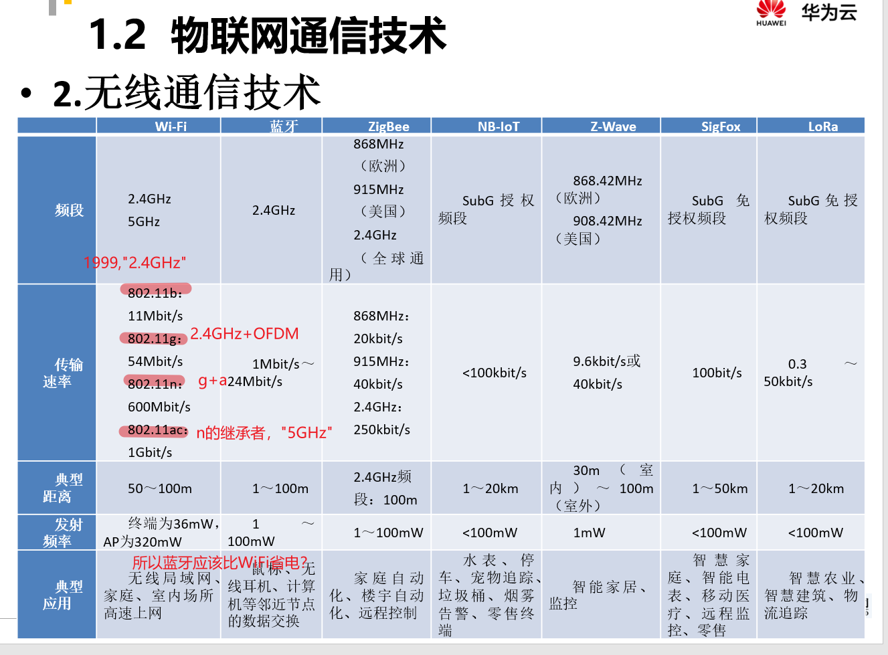
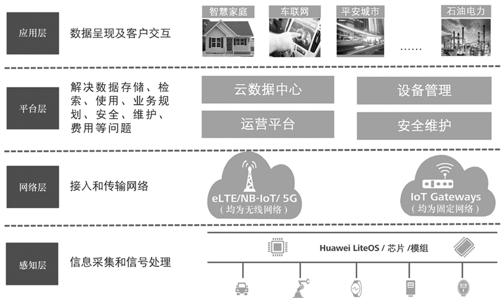
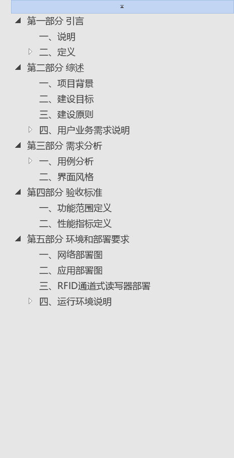
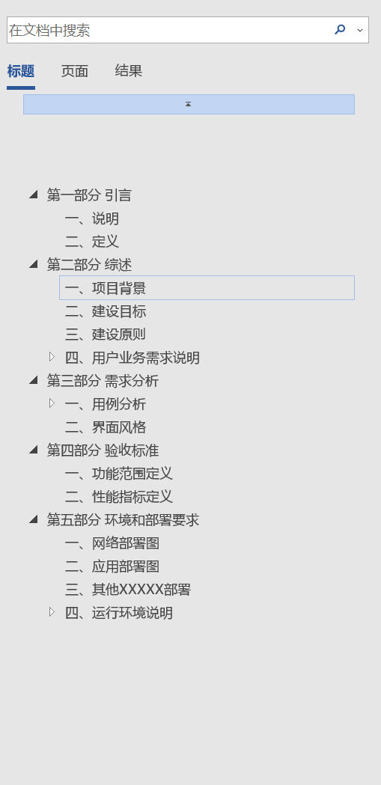

# day4 日报

## 工作总结

### 烟感Node-RED实现

#### 补充！

##### 如何远程控制ui界面

-   一些方案

[How to access node-red
remotely_stackoverflow](https://stackoverflow.com/questions/49064505/how-to-access-node-red-remotely)

[Run node-red in web browser of other
computer\_discourse.nodered](https://discourse.nodered.org/t/run-node-red-in-web-browser-of-other-computer/10800)

[Using Termux app to run Node-RED on Android
devices](https://nodered.org/docs/getting-started/android#useful-links)

1.  利用Remote-RED Node

[Remote-RED官网](https://www.remote-red.com/en/home-en/)

[Download Remote-RED in
GooglePlay_GooglePlay](https://play.google.com/store/apps/details?id=com.looking4cache.remotered.android)

在Google Play或者AppStore上安装Remote-RED

1.  配置节点

1.  手机端操作

\+

1.  界面

### 结课用项目的讨论

## 具体案例分析

-   软件工程管理

### 智能井盖应用系统

-   stm32主控

-   gps/nb-iot

    -   可以用模拟数据

        -   nb-iot

            -   功耗低

-   三轴加速度传感器

**可以实现定位/是否倾斜**

三轴加速度传感器的数值变化后发出警报

### 智慧路灯

-   光感应，没有人车感应

-   路灯之间有一些联系

-   stm32主控

-   灯的亮度可调\*/

## 5G与NB-IOT技术的介绍

### 《华为云物联网平台技术与实践》

#### 物联网通信技术--无线通信技术

#### 物联网架构

4层

## 如何写项目需求/项目需求的demo

可以看到，大部分项目需求大致包含五部分：

1.  引言

2.  综述

3.  需求分析

4.  验收标准

5.  环境和部署要求

其中**第四部分**应当在项目策划时就有大致框架。
