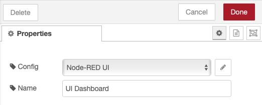
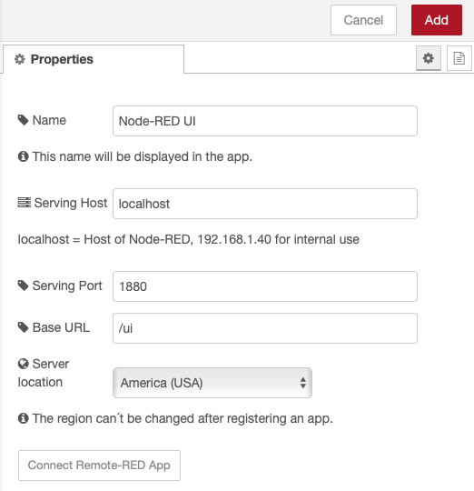
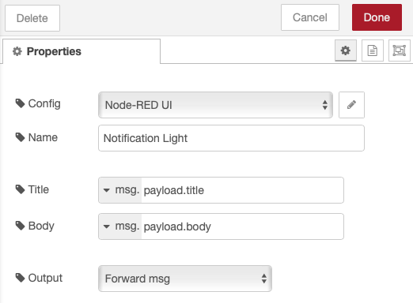
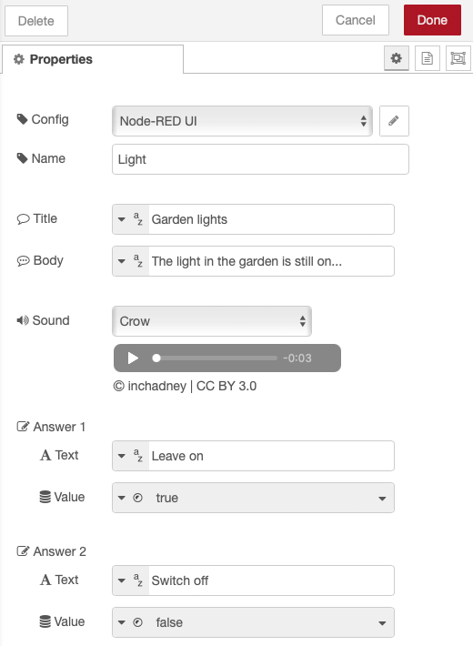

# 帮助
## 设置 Node-RED 节点
### 安装
首先，在 Node-RED 中安装 Remote-RED。使用 Node-RED Editor 中的“Manage Palette”并安装包

```node-red-contrib-remote```

### 接入节点

访问节点允许您从应用程序本地或远程访问网站。通常这是您的仪表板或 `UI Builder` 的页面。



为您要访问的每个页面创建一个“远程访问”类型的节点。除了名称，这个节点只包含一个配置节点。配置外包给配置节点，因为这些设置也用于其他功能，如推送通知。

### 配置节点

您为每个访问节点创建一个相应的配置节点。在此配置节点中，您定义将使用哪个主机、端口和 URL 建立连接。默认值以仪表板为例。也可以从本地网络配置其他页面，只要 Node-RED 服务器可以访问它们。

- **名称**：使用此标题后，页面将显示在应用程序中。
- **服务主机**：要共享网站的主机的本地IP。“localhost”使用运行访问节点的 Node-RED 服务器。
- **协议**：Web 服务器使用的协议。对于 Node-RED，这通常是 http，*但可以通过 settings.js 更改为 https*。
- **Serving Port**：将被转发的端口。对于 Node-RED，这通常是 1880，对于其他网站通常是 80。
- **基本 URL**：要调用的初始页面。



您只能编辑Serving Location(服务器位置)一次。您可以在此处指定服务器位于世界的哪个角落，用于路由您的网站。要获得快速连接，请选择离您最近的位置。

一旦您定义了这些设置并安装了 iOS 或 Android 应用程序，您就可以通过单击“Add Node-RED instance”按钮连接到ui。

### 通知节点

使用此节点，您可以向连接到所选配置节点的设备**发送推送通知**。选择您已在访问节点中使用的配置节点。您可以在多个通知节点中使用相同的配置节点。

配置通知的标题和文本。默认值假设传入通知的有效负载包含字符串“title”和“body”。您还可以输入固定文本或使用流程或全局变量。



每当消息到达通知节点时，都会向您的设备发送通知。

### 问题节点

使用此节点，您可以通过推送通知向连接到所选配置节点的设备发送问题。选择您已在访问节点中使用的配置节点。您可以在多个问题节点中使用相同的配置节点。

重要的是 confg 节点指向您的本地 Node-RED 计算机并且访问节点与其一起处于活动状态。基本 URL 无关紧要。

配置通知的标题和文本。默认值假设传入消息的有效负载包含字符串“title”和“body”。您还可以输入固定文本或使用流程或全局变量。

您最多可以指定三个答案。答案的文本可以作为字符串直接输入或从传入的消息中获取。如果文本为空，则不显示答案。当您选择此答案时，您可以使用该值指定节点在 msg.payload 中输出的内容。

每当消息到达问题节点时，都会向您的设备发送通知。



## 安装并连接应用程序
### 安装软件
您可以从 Apple AppStore 或 Google PlayStore 安装应用程序。该应用程序会在第一次启动后询问您是否允许向您发送推送通知。如果您想使用通知功能，请允许这样做。

### 实例
在应用程序中，使用术语 Node-RED 实例。实例是与 Node-RED 配置节点的连接。在应用程序中，您可以添加多个实例，即本地页面。

只要应用程序未连接到至少一个配置节点，您就无能为力。

### 连接应用程序
当您连接应用程序时，它会传输证书以访问您的本地站点。配置也被传输。对于这些字段的后续更改，必须删除并重新连接应用程序中的实例。

在 Node-RED 中打开要连接的配置节点。按“连接 Remote-RED 应用程序”按钮。配置节点现在连接到其中一个 Remote-RED 服务器，不久之后它会显示一个二维码。

在应用程序中使用“Connect Node-RED Instance”功能并扫描二维码。该应用程序现在应该已连接。要连接其他应用程序（例如在另一部手机上），再次按下按钮并生成另一个二维码。

使用“添加”或“更新”离开配置节点，然后使用“部署”保存更改非常重要。

## 故障排除
### Node-RED 内部的网络错误
在 Node-RED 中安装 Remote-RED Access-Node 的计算机当然需要 Internet 访问。如果您在连接应用程序时遇到“网络错误”，则您的 Node-RED 机器很可能无法访问我的服务器。如果使用防火墙，则必须允许以下路径：

#### 服务器位置“美国（美国）”：

将端口 443 输出到 contact-us.remote-red.com / 209.126.0.212 / 2605:a140:3006:3078::1 以添加新实例
出站端口 443 到 api-nodered03.remote-red.com / 209.126.0.212 / 2605:a140:3006:3078::1 用于 API 通信
SSH 隧道的传出端口范围 50000-60000 到 proxy-nodered03.remote-red.com / 209.126.0.212 / 2605:a140:3006:3078::1
#### 服务器位置“欧洲（德国）”：

将端口 443 输出到 contact-de.remote-red.com / 173.212.245.41 / 2a02:c207:3006:3079::1 以添加新实例
出站端口 443 到 api-nodered02.remote-red.com / 173.212.245.41 / 2a02:c207:3006:3079::1 用于 API 通信
SSH 隧道的传出端口范围 50000-60000 到 proxy-nodered02.remote-red.com / 173.212.245.41 / 2a02:c207:3006:3079::1
