# day5日报

## 今天工作安排
1. 上午
- 每日例会
2. 下午
- 周例会
3. 墨子号接入华为云/BC26 LwM2M 华为云
4. 项目的文档该开始写了

---
## 今日参考文档

0、墨子号的接入手册
博客
1、BC95 MQTT接入
https://bbs.huaweicloud.com/blogs/249333

2、BC95 lwm2m接入
https://bbs.huaweicloud.com/blogs/249241

3、论坛 看上去比较靠谱
https://bbs.huaweicloud.com/forum/thread-24479-1-1.html

4、墨子号的源码

5、小熊派
https://support.huaweicloud.com/bestpractice-iothub/iot_bp_0007.html

---
## BC26模块使用LwM2M协议接入华为IoT平台

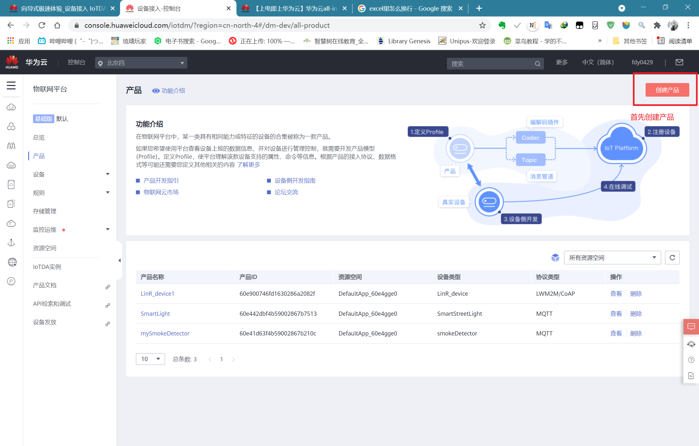

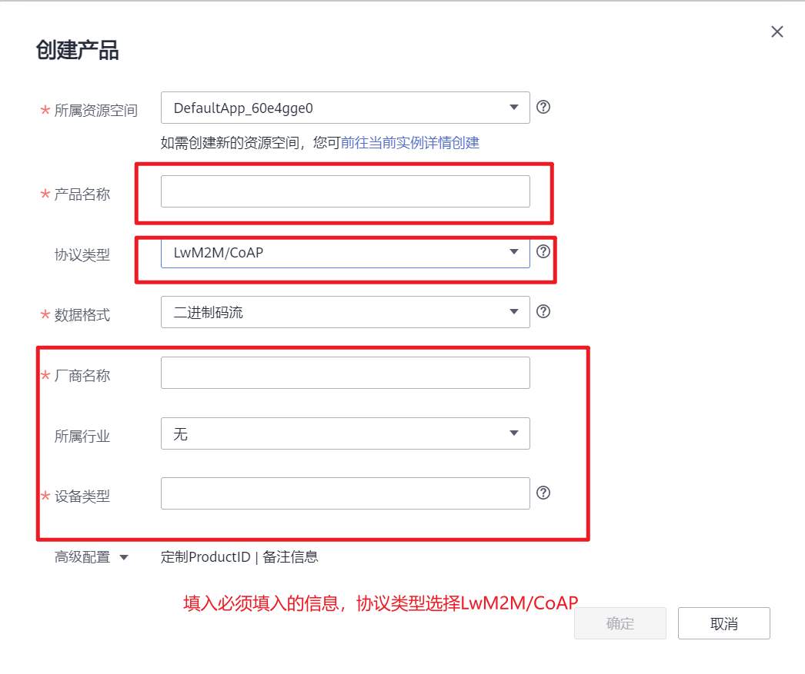

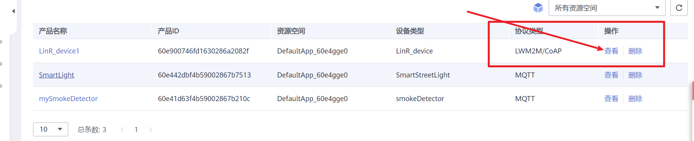

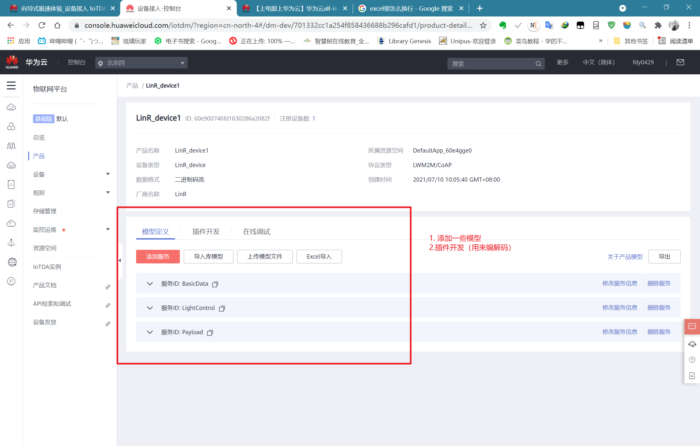

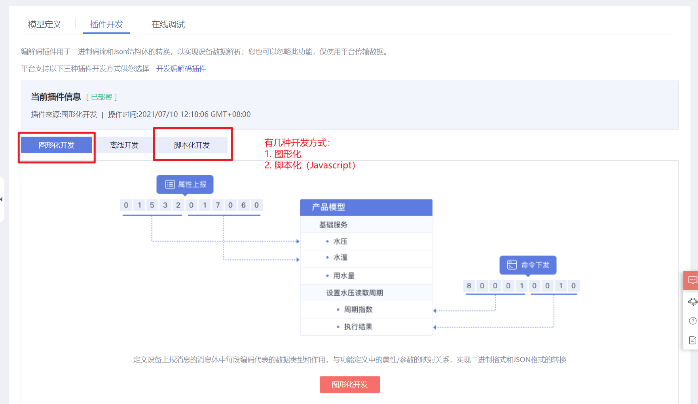

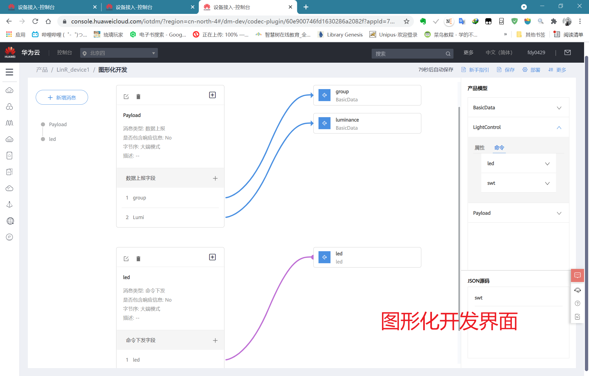

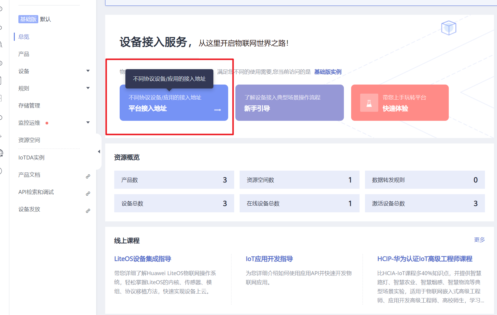

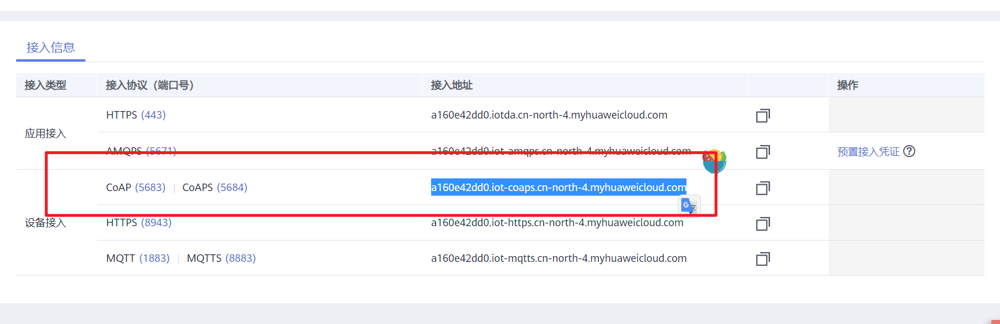

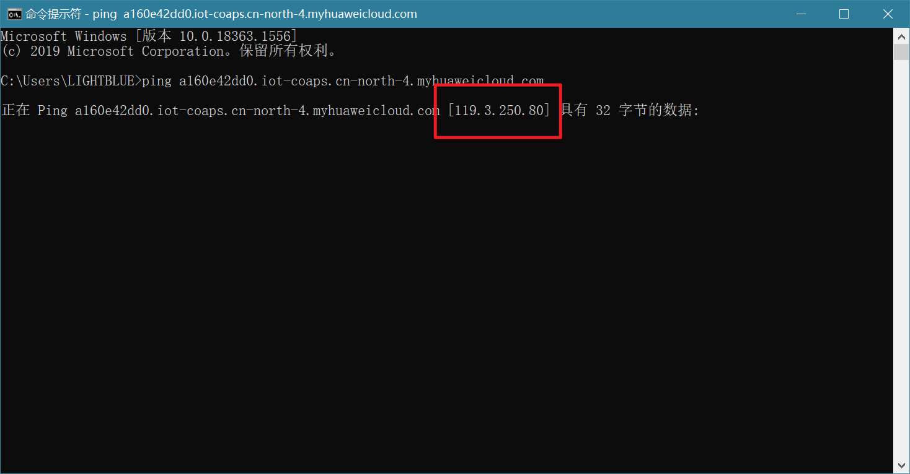

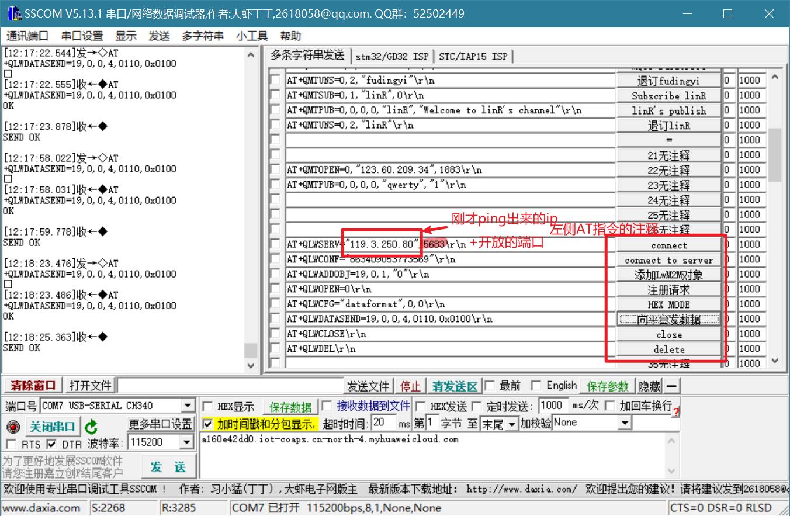

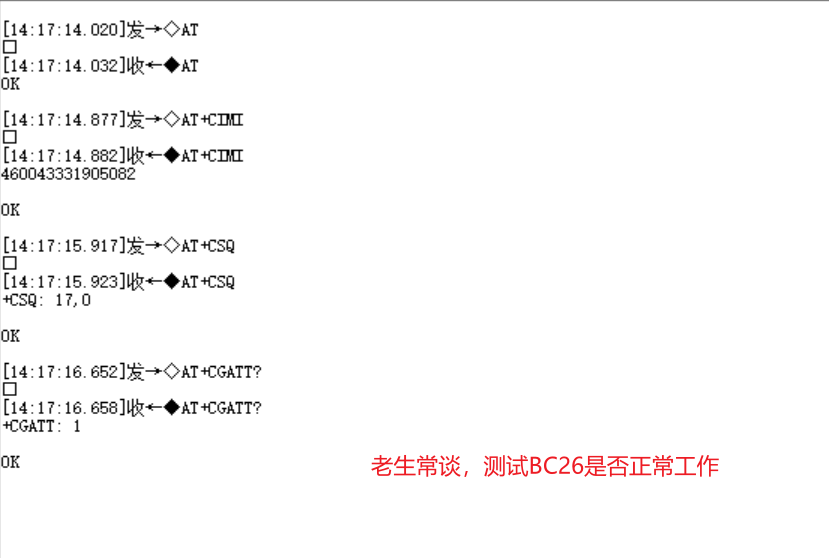

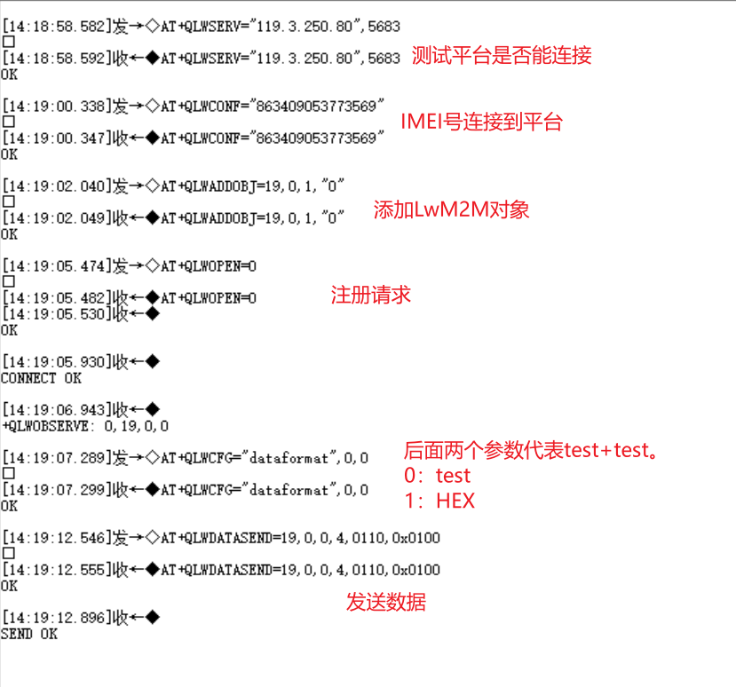

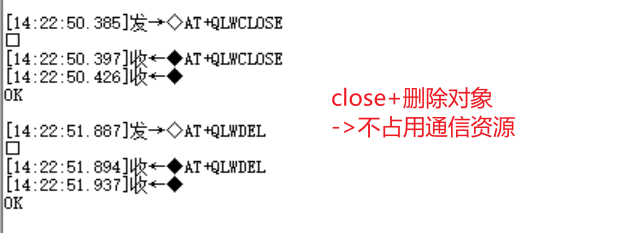

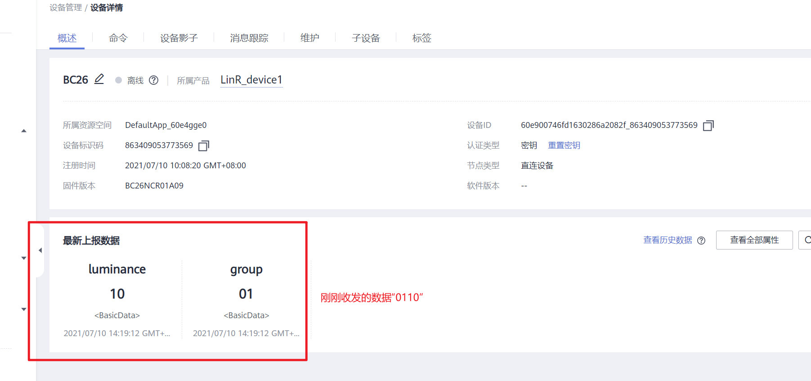

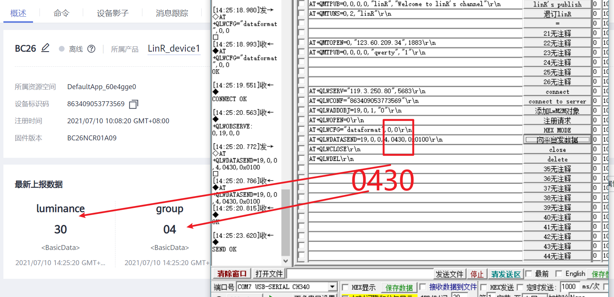

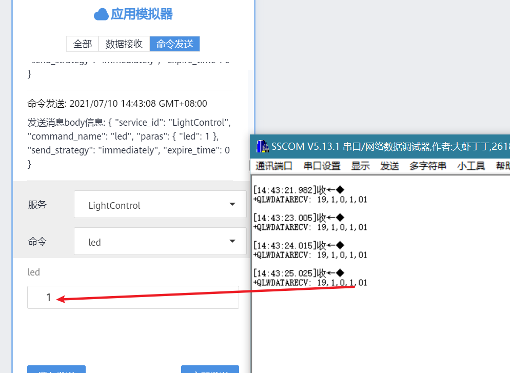

## today
- 整理单片机&传感器
- 一些之前写过的文档
    - 先写内容再整理格式
- keil环境
    - stm32g0/F1/F4?
    - cube
    - hal
    - jtag/uart？
