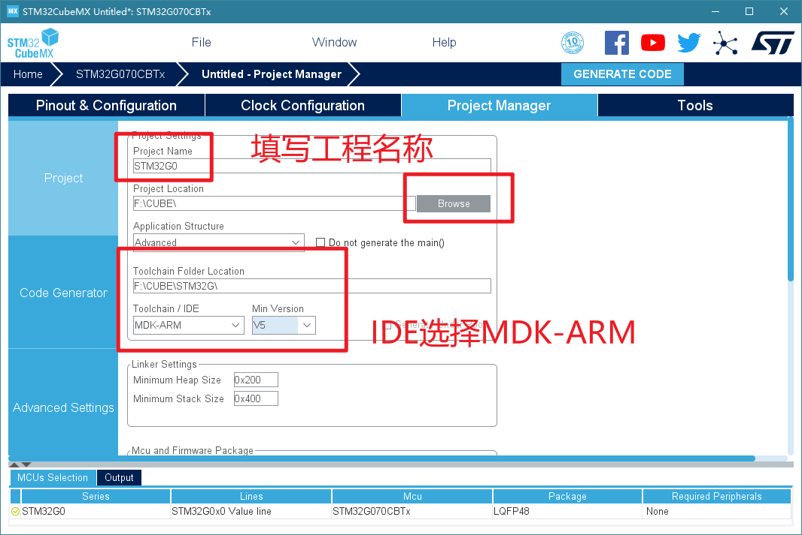
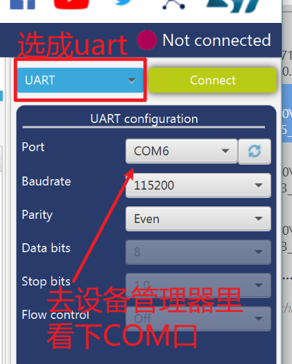
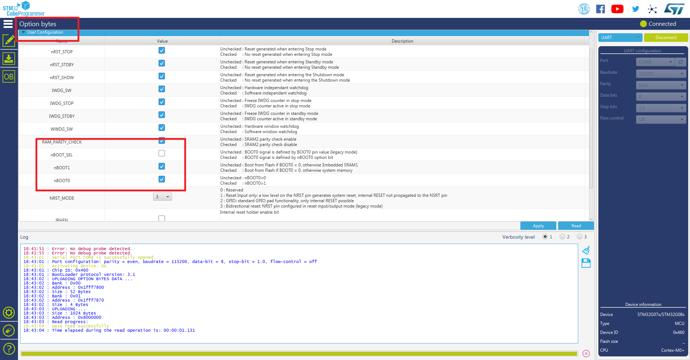

# day5日报

## 今天工作安排
1. 上午
- 每日例会
2. 下午
- 周例会
3. 墨子号接入华为云/BC26 LwM2M 华为云
4. 项目的文档该开始写了

---
## 今日参考文档

0、墨子号的接入手册
博客
1、BC95 MQTT接入
https://bbs.huaweicloud.com/blogs/249333

2、BC95 lwm2m接入
https://bbs.huaweicloud.com/blogs/249241

3、论坛 看上去比较靠谱
https://bbs.huaweicloud.com/forum/thread-24479-1-1.html

4、墨子号的源码

5、小熊派
https://support.huaweicloud.com/bestpractice-iothub/iot_bp_0007.html

---
## BC26模块使用LwM2M协议接入华为IoT平台

## today
- 整理单片机&传感器
- 一些之前写过的文档
    - 先写内容再整理格式
- keil环境
    - stm32g0/F1/F4?
    - cube
    - hal
    - jtag/uart？
---

## STM32相关环境配置与使用

### 1. MDK与Keil破解
因为之前做过电子设计竞赛使用过同是ARM内核的TI的板卡(TM4C123GH6PM、TM4C1294)、以及进行过简单的STM32F10x的开发项目，所以环境大部分是配好的。

### 2. STM32G0 dfp pack安装

双击安装包即可安装。

### 3. STM32CubeMX的安装

双击安装包即可安装。

### 4. STM32CubeMx使用

STM32Cubemx是一个图形工具，允许STM32微控制器和微处理器的非常简单的配置，以及ARM®Cortex®的ARM®Cortex-M核心或部分Linux®设备树的相应初始化C代码的生成 通过逐步处理核心）。

这里如果电脑中之前写过Java代码/配置过高级别jre/配置过高级别jdk，会出现一个奇怪的问题：
**stm32cubemx the code is successfully generated under but MDK-ARM V5 Project**

代码生成成功，但是MDK project启动文件生成有错误。（类似于下图的弹窗）。

这就是由于java版本过高导致的编译错误。

解决方案有两种：
1. 在电脑中卸载掉所有的jre和jdk后，更换成**低版本jre**；
2. 可以使用生成其他IDE之后在keil中的同路径下建立新的工程。

解决后，即可直接选择Open Project，即可打开keil工程。

编译后，由于STM32G0板卡上没有jtag预留口，且jtag手动插线比较繁琐，所以使用uart连接后再烧录上板。这时就要用到STM32CubeProgrammer。

### 5. STM32CubeProgrammer的安装与使用

同样的，直接双击安装包即可安装`STM32CubeProgrammer`。

最后点击connect，可以连接上板卡。

按照以下步骤配置：

---
## 有关于单片机 相关总结
1. uart串口烧录也很麻烦，所以准备使用stm32f10x的板卡，用jtag直接在keil中下载。
2. HAL库开发有待学习。
