# day6

## 今日收获

1. `clean.bat` 解放双手
2. 复习寄存器操作
3. HAL库的使用
    - 配合CubeMX
    - 简单的GPIO配置
    - 更加简单的中断
4. 代码的移植
    - 使用HAL库，快速移植代码
## clean.bat 批处理

- 用来清理工程中的编译后文件。在传输中可以节约时间和空间。

```bat
del *.bak /s
del *.ddk /s
del *.edk /s
del *.lst /s
del *.lnp /s
del *.mpf /s
del *.mpj /s
del *.obj /s
del *.omf /s
::del *.opt /s  ::不允许删除JLINK的设置
del *.plg /s
del *.rpt /s
del *.tmp /s
del *.__i /s
del *.crf /s
del *.o /s
del *.d /s
del *.axf /s
del *.tra /s
del *.dep /s
del JLinkLog.txt /s

del *.iex /s
del *.htm /s
del *.sct /s
del *.map /s
exit
```

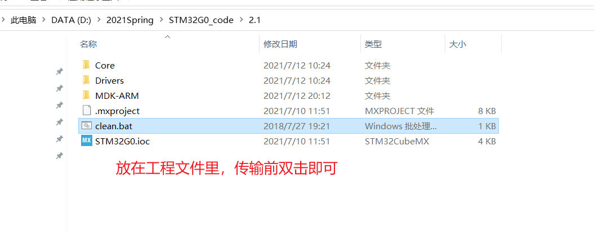


## STM32的开发

1. 寄存器
2. std库
3. HAL库

*今天主要任务*：用不同的方式点亮LED

注：

    1. 因为STM32G0引脚比较少
    2. STM32G0没有预留JTAG的口，如需要使用JTAG需要手动连杜邦线
    3. 如果使用串口下载方式，个人认为比较繁琐
    - 因为有STM32F1开发板，所以将单片机型号改为STM32F103RCT6.大部分代码相同，逻辑上全部类似；可以使用JTAG，方便程序调试。

### STM32寄存器开发方法

#### 认识寄存器

##### 什么是寄存器？

在数字电子，尤其是计算中，硬件寄存器是通常由触发器组成的电路，通常具有许多类似于存储器的特性，例如：

- 一次读取或写入多个位的能力
- 使用地址以类似于内存地址的方式选择特定寄存器

然而，它们的显着特点是它们还具有超出普通内存的特殊硬件相关功能。所以，从不同的角度来看，硬件寄存器就像内存，具有额外的硬件相关功能；或者，内存电路就像只存储数据的硬件寄存器。

硬件寄存器用于软件和外设之间的接口。软件写入它们以向设备发送信息，并读取它们以从设备获取信息。一些硬件设备还包括软件不可见的寄存器，供其内部使用。

> 详见《微机原理与接口技术》

##### 如何寻找 STM32F103RCT6 的寄存器


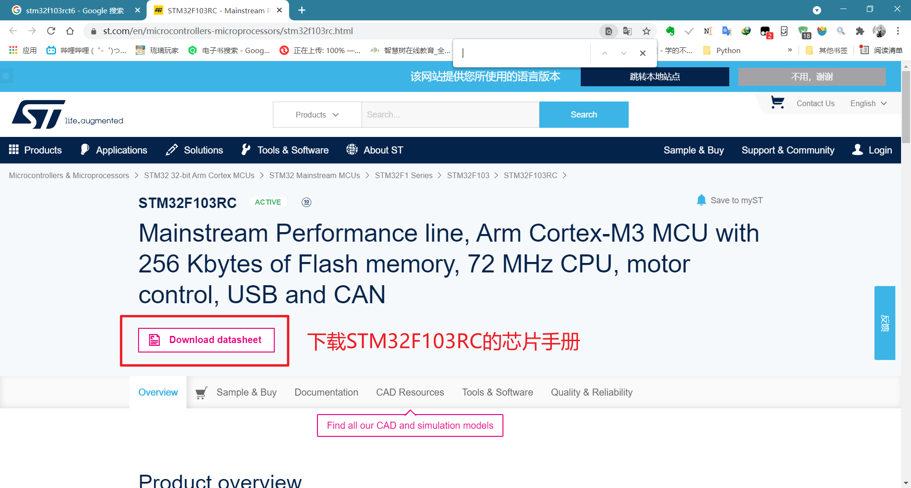

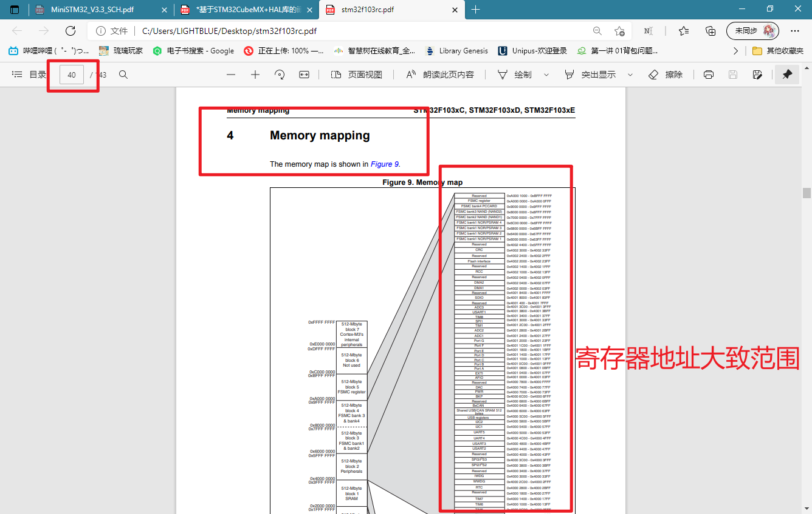

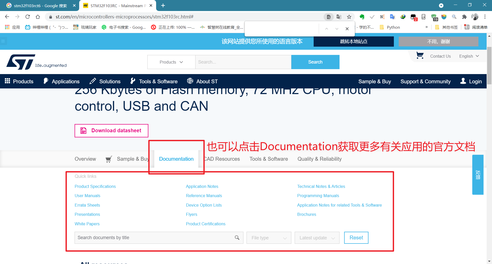

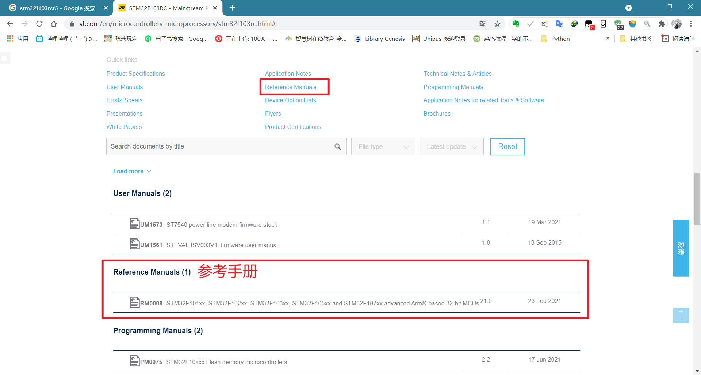

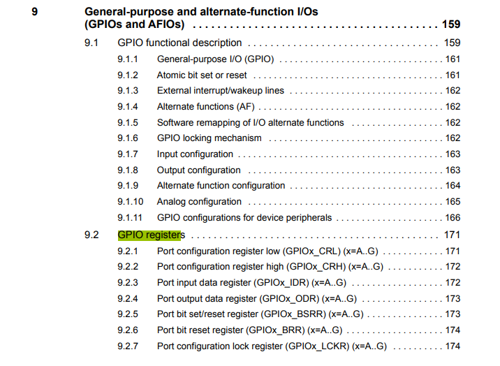

（P194）

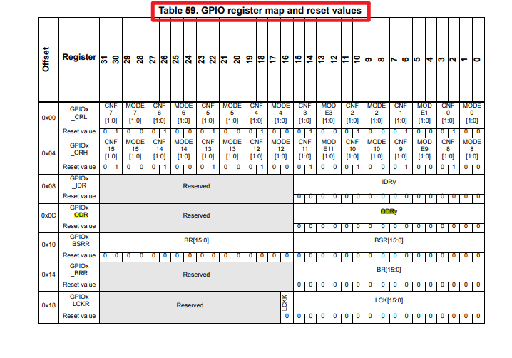

并不觉得像STM32这类功能强大的单片机应当用寄存器的方式来开发。

以上课时用STM32G0编写的一段代码来解释。

与之前接触过的std库函数相比，无论从可读性还是开发的速度和对开发者的要求上，库函数开发都略胜寄存器开发一筹。

##### 使用寄存器(STM32G0)

所有的配置文件都可以使用STM32CubeMX生成。都是相同的流程。

> 详见day5日报.

1. 点亮流水灯（优化）

主要代码

```C
#define MY_ MODE_OUTPUT_ PP 0
#define MY_ MODE_OUTPUT_ OD 0
#define MY_SPEED_LOW        0
#define MY_SPEED_MID        1
#define MY_SPEED_HIGH       2
#define MY_SPEED_VERY_HIGH  3

void IO_Init(GPIO_TypeDef * GPIOx,uint16_t mode,uint8_t speed)
{
    if((mode == MY_MODE_OUTPUT_PP) || (mode == MY_MODE_OUTPUT_OD))//output mode
    {
        GPIOx->MODER &= ~(0x3<<(pin*2));
        GPIOx->MODER |= (0x1<<(pin*2));
        if(mode == MY_MODE_OUTPUT_PP)
            GPIOx->OTYPER &= 0<<pin;
        else if(mode == MY_MODE_OUTPUT_OD)
            GPIOx->OTYPER |= 1<<pin;
        GPIOx->OSPEEDR &= ~(0x3<<(pin*2));
        GPIOx->OSPEEDR |= speed<<(pin*2);
    }

}

```

2. 使用结构体

```C
#include <stm32g0xx.h>  //这里存入了寄存器的定义表
/*USER Define-----------------------------*/
#define MY_MODE_OUTPUT_PP	0
#define MY_MODE_OUTPUT_OD 	1
#define MY_SPEED_LOW 		0
#define MY_SLEED_MID 		1
#define MY_SPEED_HIGH 		2
#define MY_SPEED_VERY_HIGH 	3
/*Define End------------------------------*/

//用户自己定义结构体，方便后续输入
typedef struct {
    uint16_t pin;
    uint8_t DirOrSpeed;//输入还是输出，速度
    uint8_t PP_OD_Pull;//输出模式
} myGPIO_ST;

//延时函数
void delay(unsigned int a) {
    while(a--) {
        ;
    }
}

void IO_Init(GPIO_TypeDef *GPIOx,myGPIO_ST* st) {
    uint8_t temp;
    if (st->DirOrSpeed > 0) { //不是输入模式。暂时只处理输出
        GPIOx->ODR &= ~(0xf << st->pin*4);
        temp =(st->PP_OD_Pull<<2)|(st->DirOrSpeed);
        GPIOx ->ODR |= temp << (st->pin*4);
    }
}

int main() {

    RCC->IOPENR |= RCC_IOPENR_GPIOBEN;
    myGPIO_ST myGPIO;
    myGPIO.pin = 0;
    myGPIO.DirOrSpeed = MY_SPEED_LOW;
    myGPIO.PP_OD_Pull = MY_MODE_OUTPUT_PP;

    IO_Init(GPIOB,&myGPIO);

    while(1) {
        GPIOB->ODR &= ~(0x1<<(0*1) | (1*1));
        delay(0xfffff);
        GPIOB->ODR |= (0x1<<(0*1) | (1*1));
        delay(0xfffff);
    }
}
```

3. 独热码

```C
#define PIN_0 ((uint16_t)0x0001)
#define PIN_1 ((uint16_t)0x0002)

void myIO_Init(GPIO_TypeDef *GPIOx,myGPIO_ST* st) {
    uint8_t temp;
    uint16_t i=0, j = 0, index = 0;
    if (st->DirOrSpeed > 0) { //不是输入模式。暂时只处理输出
        for(i = 0; i < 16; i++) { //从小到大，检查引脚对应的位是否置 1
            j = 1<<i;
            index = st->pin & j;
            if(index == j) { //如果第 j 个引脚对应的位置 1
                GPIOx->CRL &= ~(0xf << i*4);
                temp =(st->PP_OD_Pull<<2)|(st->DirOrSpeed);
                GPIOx ->CRL |= temp << i*4;
            }
        }
    }
}
```

在数字电路和机器学习中，one-hot 是一组bit，其中合法的值组合只有单个高 (1) 位和所有其他低 (0) 位。 [1]一种类似的实现，其中所有位都为“1”，除了一个“0”，有时被称为 one-cold。

>Advantages
>
>Determining the state has a low and constant cost of accessing one flip-flop
>Changing the state has the constant cost of accessing two flip-flops
>Easy to design and modify
>Easy to detect illegal states
>Takes advantage of an FPGA's abundant flip-flops
>Using a one-hot implementation typically allows a state machine to run at a faster clock rate than any other encoding of that state machine.[3]

[One-hot_From Wikipedia, the free encyclopedia](https://en.wikipedia.org/wiki/One-hot)

4. 怎样编写用户的头文件


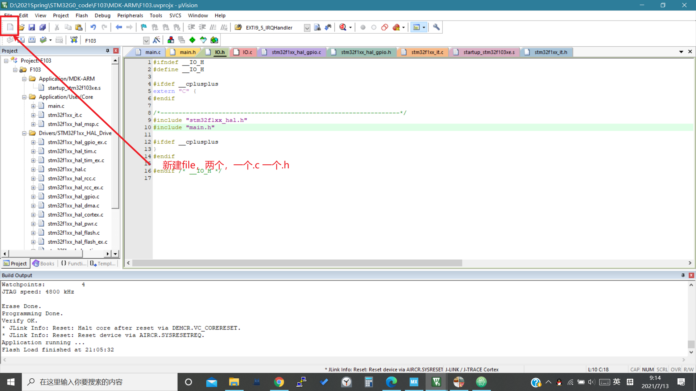

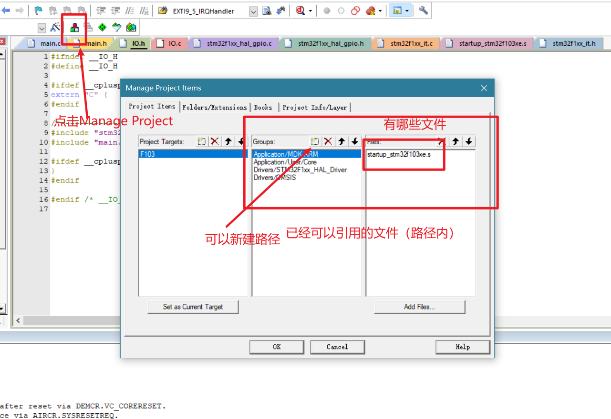


### HAL库


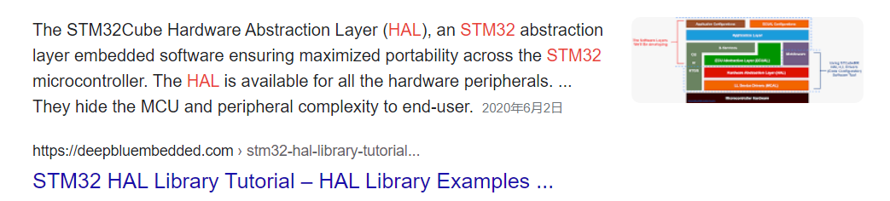

STM32Cube硬件抽象层（HAL），STM32抽象层嵌入式软件，可确保STM32微控制器上最大的可移植性。 HAL适用于所有硬件外围设备。他们隐藏MCU和外设复杂度到最终用户。

#### 从寄存器到HAL库

寄存器操作让我想起刚接触单片机时，我开始使用<u>MSP430</u>的寄存器开发的方式，代码可读性比较差（即便当时写了简单的注释，现在读起来也比较吃力）；唯一的好处是让我对指针有了进一步的了解。

- *其实《微机原理》解释得还蛮清楚的*


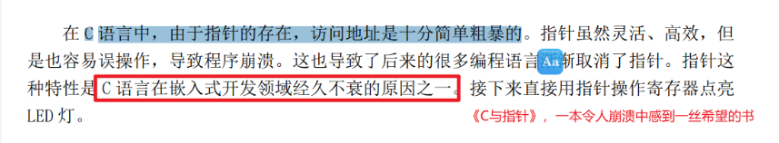


#### 使用HAL函数点亮LED

##### 1. 使用CubeMX配置工程

> 详见day5日报

- 如何找到板卡上的LED2连接的引脚？

因为我使用的是正点原子F103RCT6的板卡，所以需要到厂家提供的开发板原理图中找。

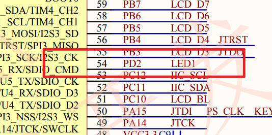

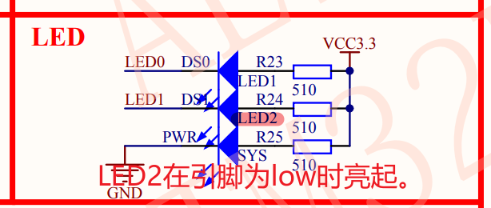

##### 2. 打开Keil进行main.c的编写

在main文件之中，只需要编写`while(1)`中的具体语句即可。

```C
  /* Infinite loop */
  /* USER CODE BEGIN WHILE */
  while (1)
  {
    HAL_GPIO_TogglePin(LED2_GPIO_Port,LED2_Pin);
    HAL_Delay(1000);
    /* USER CODE END WHILE */

```


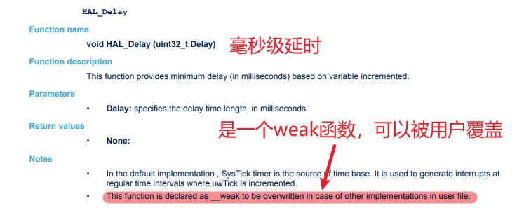

##### 3. 下载与调试

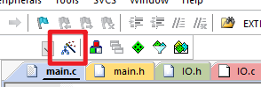


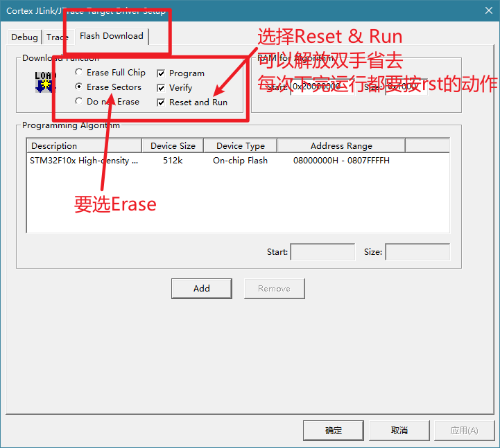

配置好JTAG就可以烧录板卡了。


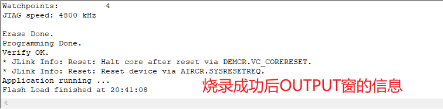

点击`settings`。

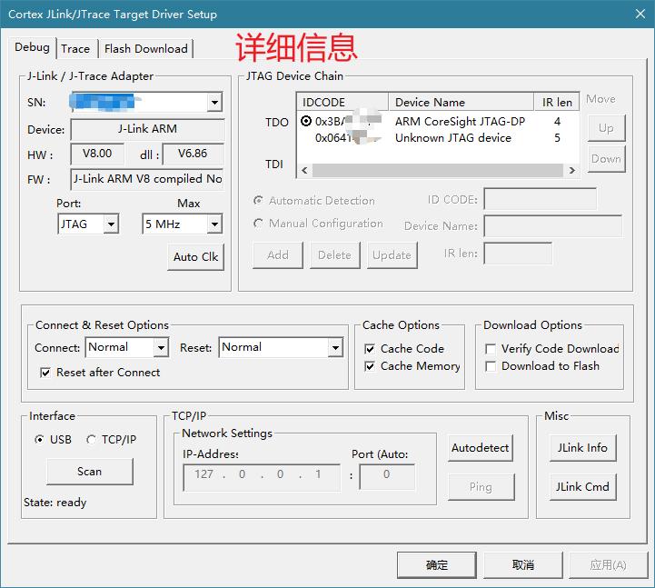


**注意**：
1. 在CubeMX生成的工程文件中，如需用户自己书写代码，必须要按照CubeMX分配好的空间来写。否则在下一次使用CubeMX进行新的配置时，用户的代码会丢失。
2. 翻转LED的电平后，记得延时。否则闪烁过快，看不到明显的现象。


#### 使用HAL函数利用按键控制LED电平翻转

##### 1. 使用CubeMX配置工程

首先，需要在原理图上找到KEY0对应的GPIO。


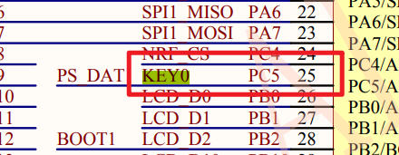

当然还有小灯。（同上个）

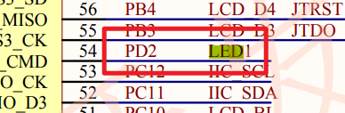

接下来就在CubeMX中配置这两个GPIO。其中，PC5为Input，PD2为Output。具体参数见图。

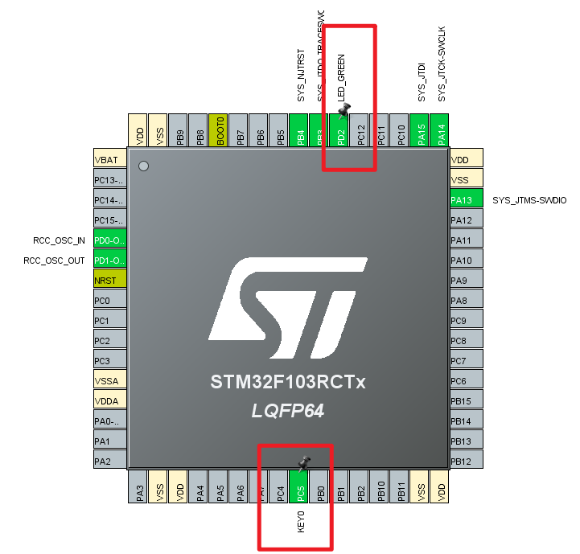

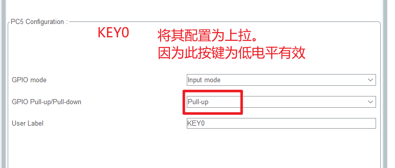

也可以不配置成上拉。因为有硬件结构。但是为了方便以后可以更换引脚（移植）所以还是配置成了上拉模式。


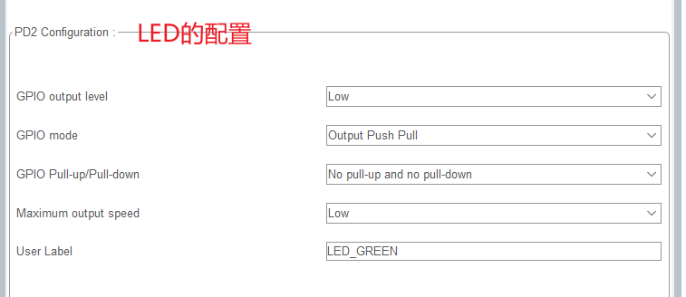

最后点击Generate即可。

##### 2. 编写main.c

同样只需要编写`while(1)`里的代码即可。

```C
  /* Infinite loop */
  /* USER CODE BEGIN WHILE */
    while (1) {
		if(KEY0 == 0){
			HAL_Delay(10);//软件消抖
			while(!KEY0)//等待KEY无效
				;
			HAL_Delay(10);//软件消抖
			HAL_GPIO_TogglePin(LED_GREEN_GPIO_Port,LED_GREEN_Pin);//翻转电平
		}
    /* USER CODE END WHILE */
```

##### 3. 烧录程序

同样，连接好JTAG和板卡后，点击Translate-Bulid-Download即可成功烧录。
