# day7

## 中断与内部中断

### 之前的讲稿（以TM4C123GH6PM为例的）
1. 中断的概念
    - 什么是中断?
    - 为什么要有中断?/中断这个功能存在的意义?
2. 中断的使用
    - 构想中断的使用场景
3. 中断程序的设计(以按键为例)
    - 板子上面按键还有LED对应的引脚→原理图给出
    - 框图→如何实现这个功能?
    - 程序源码给出


#### 中断的概念
1. 生活实际例子
- 假定一个情景：你现在在家写作业。你朋友给你发QQ让你现在帮他看个游戏装备。你没有理他，因为在你的心里*学习比装备重要*。
- 你刚刚继续学习三分钟之后，你闻到厨房里有一股糊味。你赶紧去把火关了。因为*避免失火比学习重要*。
2. 什么是中断？
- 暂停原先的程序或事情，执行另外一些程序或事情，执行完成后返回原来的程序。
3. 为什么要有中断？
- 因为**另一些程序或事情比你原先正在做的事情要重要**，或者这些突发事情你是**无法控制它的来临**的。
#### 中断的使用
- 初级的，简单的应用A
    - 用SW0/1控制LED
        - [x] 亮/灭
        - [x] 换个颜色

#### 程序设计

##### 源码

```c
#include <stdint.h>
#include <stdbool.h>
#include "inc/hw_types.h"
#include "inc/hw_memmap.h"
#include <inc/hw_gpio.h>
#include "driverlib/sysctl.h"
#include "driverlib/gpio.h"
#include <driverlib/rom_map.h>
#include <driverlib/rom.h>
#include <inc/hw_ints.h>
#include <driverlib/interrupt.h>
#include "driverlib/sysctl.h"

int flag;
void INT_GPIOF_Handler(void);
void vGPIO_Config_1(void);

int main(void)
{
    SysCtlClockSet(SYSCTL_SYSDIV_4|SYSCTL_USE_PLL|SYSCTL_XTAL_16MHZ|SYSCTL_OSC_MAIN);
    //system control clock set  400kHZ/(4*2)
    vGPIO_Config_1();

    GPIOPinWrite(GPIO_PORTF_BASE, GPIO_PIN_1|GPIO_PIN_2, 0XFF);   //the initial state of LED
    while(1)
        ;     //waiting for the interrupts
}


void vGPIO_Config_1(void)
{
    SysCtlPeripheralEnable(SYSCTL_PERIPH_GPIOF); //Enable a peripheral

		// -Workshop 14.2 API Fuctions
    IntEnable(INT_GPIOF); //The specified interrupt is enabled in the interrupt controller
    IntPrioritySet(INT_GPIOF,0); //Smaller numbers correspond to higher interrupt priorities; priority 0 is the highest interrupt priority.
    IntRegister(INT_GPIOF,INT_GPIOF_Handler); //Registers a function to be called when an interrupt occurs

    GPIOPinTypeGPIOOutput(GPIO_PORTF_BASE,GPIO_PIN_1 | GPIO_PIN_2 | GPIO_PIN_3 ); //Configures pins for use as GPIO outputs
    GPIODirModeSet(GPIO_PORTF_BASE,GPIO_PIN_4|GPIO_PIN_0,GPIO_DIR_MODE_IN);
    GPIOPadConfigSet(GPIO_PORTF_BASE,GPIO_PIN_0|GPIO_PIN_4,GPIO_STRENGTH_2MA,GPIO_PIN_TYPE_STD_WPU);

    GPIOIntEnable(GPIO_PORTF_BASE,GPIO_INT_PIN_4);
    GPIOIntTypeSet(GPIO_PORTF_BASE,GPIO_PIN_4,GPIO_FALLING_EDGE );
    IntMasterEnable(); //Enables the processor interrupt.
}

void INT_GPIOF_Handler(void)
{
     GPIOIntClear(GPIO_PORTF_BASE, GPIO_INT_PIN_4);
     flag++;   //switch the states of the LED
     if(flag==4)
		flag=1;
     switch(flag)
     {
        case 1: GPIOPinWrite(GPIO_PORTF_BASE,GPIO_PIN_1|GPIO_PIN_2 |GPIO_PIN_3,GPIO_PIN_2 |GPIO_PIN_3); break;
        case 2: GPIOPinWrite(GPIO_PORTF_BASE,GPIO_PIN_1|GPIO_PIN_2 |GPIO_PIN_3,GPIO_PIN_1|GPIO_PIN_3); break;
        case 3:GPIOPinWrite(GPIO_PORTF_BASE,GPIO_PIN_1|GPIO_PIN_2 |GPIO_PIN_3,0XFF); break;
     }
}
```


其实TM4C标准库和STM32std库的使用感觉是类似的。

## 中断嵌套


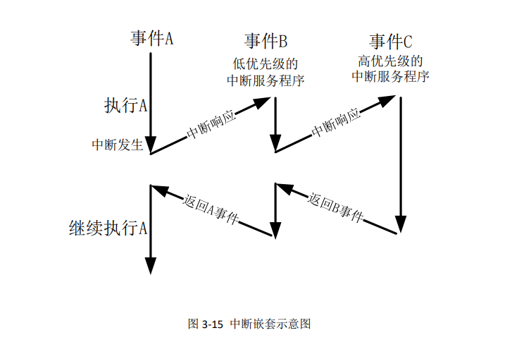

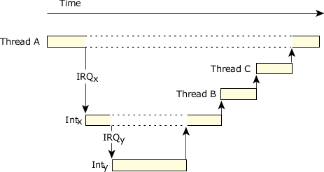

假设有三个优先级012，0是最高。
当前正在处理1级别中断。
此时如果：

1. 0级别中断唤起
    - 当前中断被打断。记录当前位置后去处理0中断；之后返回1中断继续处理，最后回到正常流程中去。
2. 2级别中断唤起
    - 2中断挂起。等待1处理完之后再来处理2。
3. 同级别中断被唤起
    - 挂起。除非同时有效，则比较子优先级。


## 使用HAL库实现按键下降沿触发中断

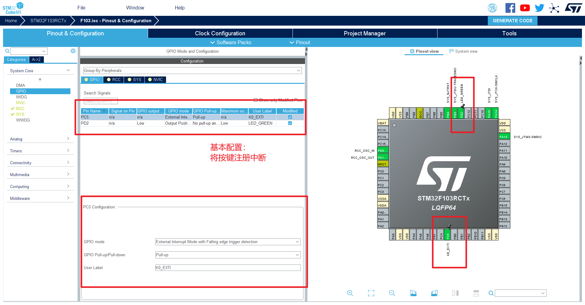

Callback function：

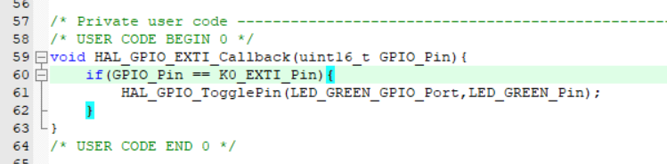


然后Translate-Build-Download即可下载到板卡。

现象：按下按键后LED电平翻转。

## 原理与分析


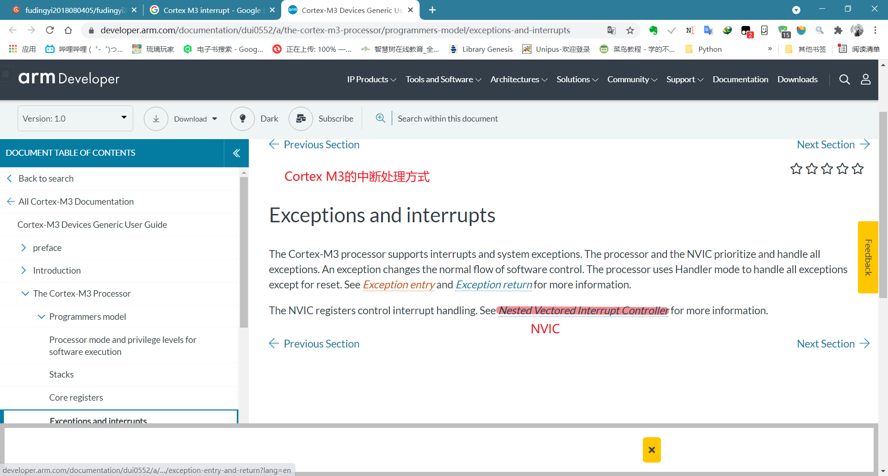


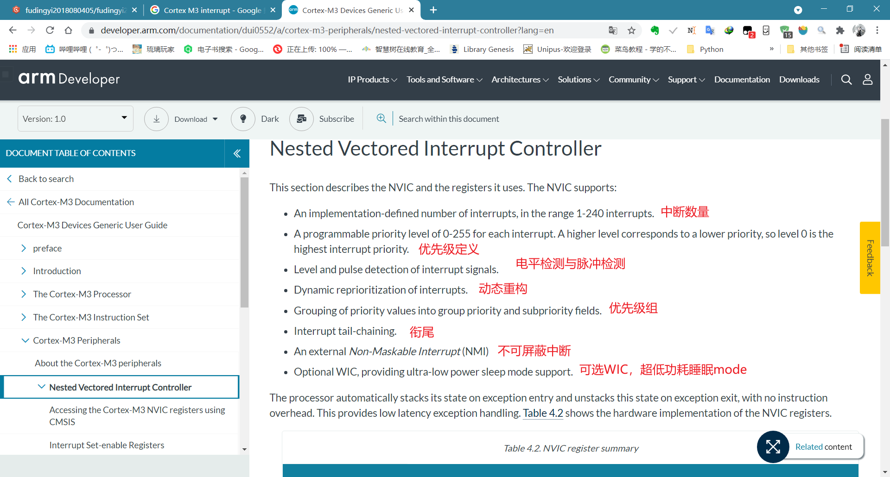


[Nested Vectored Interrupt Controller_Cortex-M3 Devices Generic User Guide](https://developer.arm.com/documentation/dui0552/a/cortex-m3-peripherals/nested-vectored-interrupt-controller?lang=en)

Tail-chaining是异常的背对背处理，没有中断之间的状态保存和恢复开销。当退出一个ISR并进入另一个ISR时，处理器跳过八个寄存器的弹出和八个寄存器的推入，因为这对堆栈内容没有影响。

- ISR：中断服务寄存器

- 为了加快响应（而产生的M3的功能）

向量表

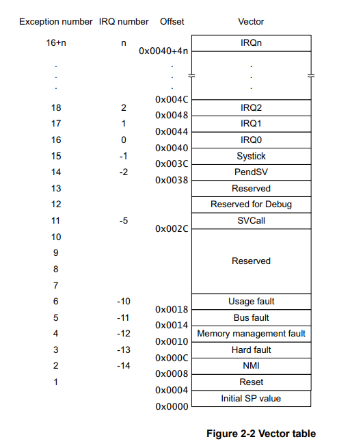

- 中断整体流程


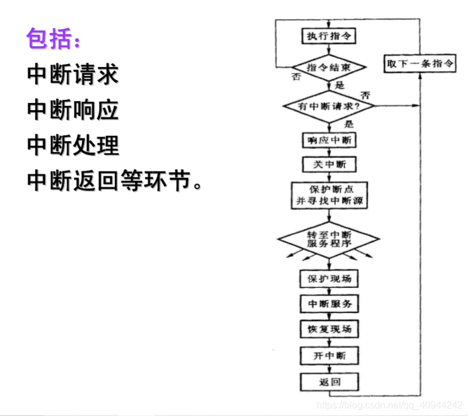

[微机原理个人总结之中断学习_CSDN](https://blog.csdn.net/qq_40944242/article/details/105771065)

> 微机原理确实创世之源

## Callback函数溯源

### 中断流程中Callback处于某位置


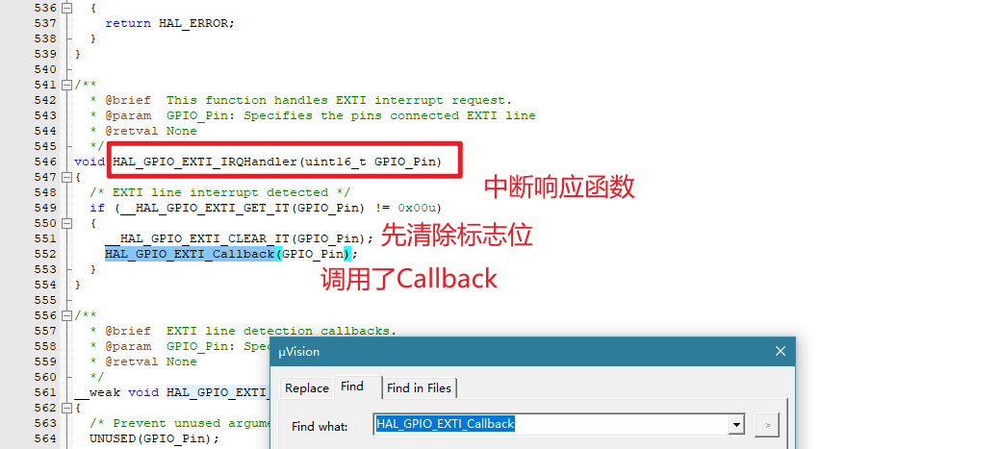

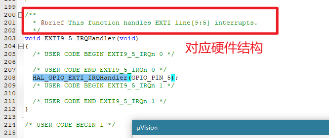

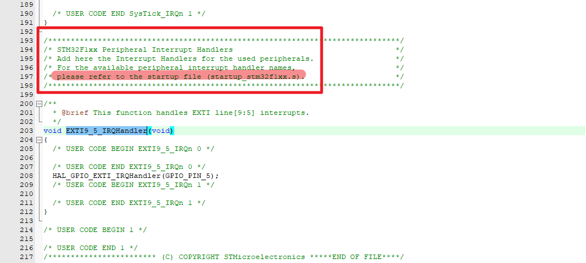

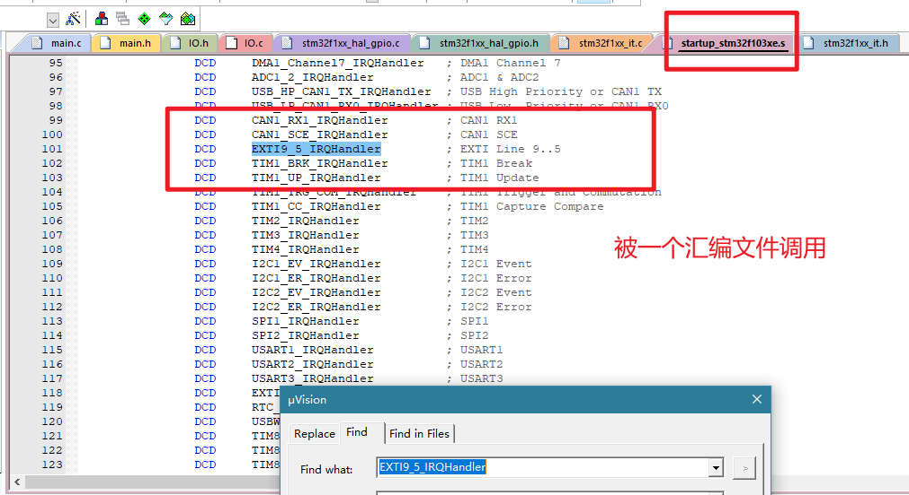

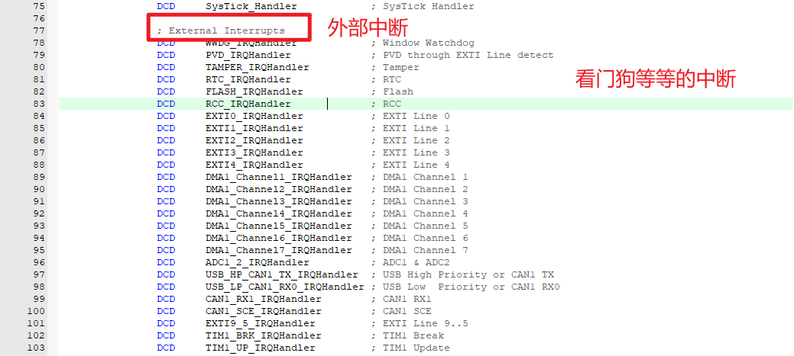

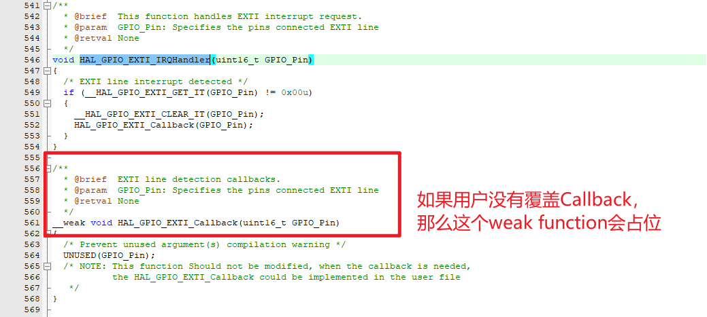
