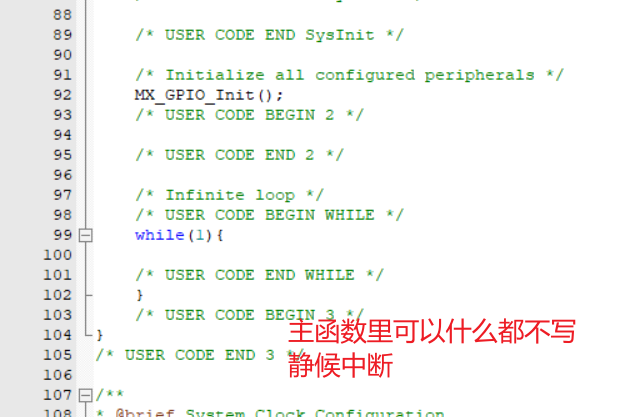
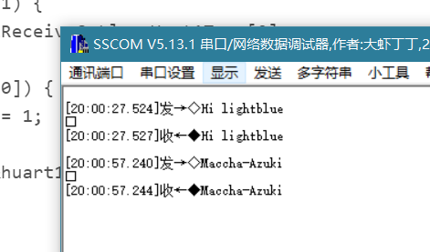

# day7

> 1. 中断

>2.  串口数据收发

## 中断与内部中断

### 之前的讲稿（以TM4C123GH6PM为例的）
1. 中断的概念
    - 什么是中断?
    - 为什么要有中断?/中断这个功能存在的意义?
2. 中断的使用
    - 构想中断的使用场景
3. 中断程序的设计(以按键为例)
    - 板子上面按键还有LED对应的引脚→原理图给出
    - 框图→如何实现这个功能?
    - 程序源码给出


#### 中断的概念
1. 生活实际例子
- 假定一个情景：你现在在家写作业。你朋友给你发QQ让你现在帮他看个游戏装备。你没有理他，因为在你的心里*学习比装备重要*。
- 你刚刚继续学习三分钟之后，你闻到厨房里有一股糊味。你赶紧去把火关了。因为*避免失火比学习重要*。
2. 什么是中断？
- 暂停原先的程序或事情，执行另外一些程序或事情，执行完成后返回原来的程序。
3. 为什么要有中断？
- 因为**另一些程序或事情比你原先正在做的事情要重要**，或者这些突发事情你是**无法控制它的来临**的。
#### 中断的使用
- 初级的，简单的应用A
    - 用SW0/1控制LED
        - [x] 亮/灭
        - [x] 换个颜色

#### 程序设计

##### 源码

```c
#include <stdint.h>
#include <stdbool.h>
#include "inc/hw_types.h"
#include "inc/hw_memmap.h"
#include <inc/hw_gpio.h>
#include "driverlib/sysctl.h"
#include "driverlib/gpio.h"
#include <driverlib/rom_map.h>
#include <driverlib/rom.h>
#include <inc/hw_ints.h>
#include <driverlib/interrupt.h>
#include "driverlib/sysctl.h"

int flag;
void INT_GPIOF_Handler(void);
void vGPIO_Config_1(void);

int main(void)
{
    SysCtlClockSet(SYSCTL_SYSDIV_4|SYSCTL_USE_PLL|SYSCTL_XTAL_16MHZ|SYSCTL_OSC_MAIN);
    //system control clock set  400kHZ/(4*2)
    vGPIO_Config_1();

    GPIOPinWrite(GPIO_PORTF_BASE, GPIO_PIN_1|GPIO_PIN_2, 0XFF);   //the initial state of LED
    while(1)
        ;     //waiting for the interrupts
}


void vGPIO_Config_1(void)
{
    SysCtlPeripheralEnable(SYSCTL_PERIPH_GPIOF); //Enable a peripheral

		// -Workshop 14.2 API Fuctions
    IntEnable(INT_GPIOF); //The specified interrupt is enabled in the interrupt controller
    IntPrioritySet(INT_GPIOF,0); //Smaller numbers correspond to higher interrupt priorities; priority 0 is the highest interrupt priority.
    IntRegister(INT_GPIOF,INT_GPIOF_Handler); //Registers a function to be called when an interrupt occurs

    GPIOPinTypeGPIOOutput(GPIO_PORTF_BASE,GPIO_PIN_1 | GPIO_PIN_2 | GPIO_PIN_3 ); //Configures pins for use as GPIO outputs
    GPIODirModeSet(GPIO_PORTF_BASE,GPIO_PIN_4|GPIO_PIN_0,GPIO_DIR_MODE_IN);
    GPIOPadConfigSet(GPIO_PORTF_BASE,GPIO_PIN_0|GPIO_PIN_4,GPIO_STRENGTH_2MA,GPIO_PIN_TYPE_STD_WPU);

    GPIOIntEnable(GPIO_PORTF_BASE,GPIO_INT_PIN_4);
    GPIOIntTypeSet(GPIO_PORTF_BASE,GPIO_PIN_4,GPIO_FALLING_EDGE );
    IntMasterEnable(); //Enables the processor interrupt.
}

void INT_GPIOF_Handler(void)
{
     GPIOIntClear(GPIO_PORTF_BASE, GPIO_INT_PIN_4);
     flag++;   //switch the states of the LED
     if(flag==4)
		flag=1;
     switch(flag)
     {
        case 1: GPIOPinWrite(GPIO_PORTF_BASE,GPIO_PIN_1|GPIO_PIN_2 |GPIO_PIN_3,GPIO_PIN_2 |GPIO_PIN_3); break;
        case 2: GPIOPinWrite(GPIO_PORTF_BASE,GPIO_PIN_1|GPIO_PIN_2 |GPIO_PIN_3,GPIO_PIN_1|GPIO_PIN_3); break;
        case 3:GPIOPinWrite(GPIO_PORTF_BASE,GPIO_PIN_1|GPIO_PIN_2 |GPIO_PIN_3,0XFF); break;
     }
}
```


其实TM4C标准库和STM32std库的使用感觉是类似的。

## 中断嵌套


假设有三个优先级012，0是最高。
当前正在处理1级别中断。
此时如果：

1. 0级别中断唤起
    - 当前中断被打断。记录当前位置后去处理0中断；之后返回1中断继续处理，最后回到正常流程中去。
2. 2级别中断唤起
    - 2中断挂起。等待1处理完之后再来处理2。
3. 同级别中断被唤起
    - 挂起。除非同时有效，则比较子优先级。


## 使用HAL库实现按键下降沿触发中断


Callback function：





然后Translate-Build-Download即可下载到板卡。

现象：按下按键后LED电平翻转。

## 原理与分析


[Nested Vectored Interrupt Controller_Cortex-M3 Devices Generic User Guide](https://developer.arm.com/documentation/dui0552/a/cortex-m3-peripherals/nested-vectored-interrupt-controller?lang=en)

Tail-chaining是异常的背对背处理，没有中断之间的状态保存和恢复开销。当退出一个ISR并进入另一个ISR时，处理器跳过八个寄存器的弹出和八个寄存器的推入，因为这对堆栈内容没有影响。

- ISR：中断服务寄存器

- 为了加快响应（而产生的M3的功能）

向量表


- 中断整体流程


[微机原理个人总结之中断学习_CSDN](https://blog.csdn.net/qq_40944242/article/details/105771065)

> 微机原理确实创世之源

## Callback函数溯源

### 中断流程中Callback处于某位置


## 串口数据收发

### 通信和通信协议的分类

#### 通信的分类


单工、全双工、半双工示意图：


[What’s the Difference between Simplex and Duplex Fibre Optic Cable?_Black Box Network](https://www.blackbox.be/en-be/page/25062/Resources/Technical-Resources/Black-Box-Explains/fibre-optic-cable/Simplex-vs-Duplex-Fibre)

#### 通信协议


典型同步通信协议SPI/SSI举例：


[ADS1118 具有内部基准和温度传感器的兼容 SPI的 16 位模数转换器 (Rev. F)_Texas Instruments](https://www.ti.com.cn/document-viewer/cn/ADS1118/datasheet/45-ZHCSEE1F#SBAS4573655)

异步串行通信举例：


[异步串行通信_Wikipedia®](https://zh.wikipedia.org/wiki/%E5%BC%82%E6%AD%A5%E4%B8%B2%E8%A1%8C%E9%80%9A%E4%BF%A1)


##### 单片机常用串行通信协议对比


|  协议   | 名称  |引脚说明|同步信号|通信方向
|  ----  | ----  |----   | ------|------
| UART  | Universal Asynchronous Receiver/Transmitter |TXD：发送端 RXD：接收端 GND：共地|异步通信|全双工
| 1-wire  | 单总线 | DQ：发送/接收端 |异步通信|半双工
|SPI    |串行外围设备接口|SCK：同步时钟；MISO：主机输入，从机输出；MOSI：主机输出，从机输入；CS：若干片选信号|同步通信|全双工
|IIC    |集成电路总线|SCK：同步时钟；SDA：数据输入/输出|同步通信|半双工

单片机使用的异步串行通信字符格式如图 4-4 所示，一般情况下是 1 位起始位，8 位数据
位，无奇偶校验，1 位停止位。


### STM32的串口资源

- 详见CubeMX

### 引脚复用与片内外设重映射

- “内部外设”

### 串口数据发送函数

- 工作方式
    - 轮询
    - 中断：接收或发送若干字节的数据就会进入中断
    - DMA：传输过程不需要CPU干预

- HAL库
    - 阻塞与非阻塞
    - 发送：阻塞


### 使用CubeMX配置串口


连线：


#### 串口重定向

- 改写C语言库函数，当连接器检查到用户编写了与 C 库函数同名的函数时，将优先使用用户编写的函数，从而实现对库函数的修改
- `printf()` 函数内部通过调用 `fputc()` 函数来实现数据输出，用户可以改写 `fputc()` 函数来实现串口重定向。

```C
/**
  * @brief: 重定向c库函数printf到DEBUG_USARTx
  */
int fputc(int ch, FILE *f) {
    HAL_UART_Transmit(&huart1, (uint8_t *)&ch, 1, 0xffff);
    return ch;
}

/**
  * @brief: 重定向c库函数getchar,scanf到DEBUG_USARTx
  */
int fgetc(FILE *f) {
    uint8_t ch = 0;
    HAL_UART_Receive(&huart1, &ch, 1, 0xffff);
    return ch;
}
```

#### main.c

在按键按下后，将`Hello world！`输出至串口。（轮询）

```C
    /* Infinite loop */
    /* USER CODE BEGIN WHILE */
    while (1) {
		if(!KEY1){
			HAL_Delay(10);
			while(!KEY1)
				;
			printf( "Hello world!\r\n");
			HAL_Delay(10);
		}

        /* USER CODE END WHILE */
```


### 应声虫实验

实验现象：“回声”。

#### 开启Rx中断


```C
void HAL_UART_RxCpltCallback(UART_HandleTypeDef *huart) {
    if(huart->Instance==USART1) {
        Uart1ReceiveBuf[Uart1ReceiveCnt] = Uart1Temp[0];
        Uart1ReceiveCnt++;
        if(0x0a == Uart1Temp[0]) {
            Uart1ReceiveFlag = 1;
        }
        HAL_UART_Receive_IT(&huart1,(uint8_t *)Uart1Temp,REC_LENGTH);
    }
}
```

#### main.c


```C
    while (1) {
        if(Uart1ReceiveFlag) {
            HAL_UART_Transmit(&huart1,Uart1ReceiveBuf,Uart1ReceiveCnt,0x10); //

            for(int i = 0; i<Uart1ReceiveCnt; i++)
                Uart1ReceiveBuf[i] = 0;
            Uart1ReceiveCnt = 0;
            Uart1ReceiveFlag = 0;
        }

        /* USER CODE END WHILE */

        /* USER CODE BEGIN 3 */
    }
```


#### 现象




### 用串口控制LED的状态

配置同前。

实验现象：通过自定的协议，向串口发送指定指令，控制LED的状态。

#### 实现判断指令逻辑


```C
if(Uart1ReceiveFlag) {
    printf( "The Received command is ：");
    HAL_UART_Transmit(&huart1,Uart1ReceiveBuf,Uart1ReceiveCnt,0x10);
    if(('L' == Uart1ReceiveBuf[0]) && ('E' == Uart1ReceiveBuf[1]) && ('D' == Uart1ReceiveBuf[2])) {
        switch(Uart1ReceiveBuf[3]) {
        case '0':
            LED_OFF;PRT_SUCCESS
            break;
        case '1':
            LED_ON;PRT_SUCCESS
            break;
        case '2':
            LED_TOG;PRT_SUCCESS
            break;
        default:
            PRT_ERROR_BIT_MSG
            break;
        }
    } else {
        PRT_ERROR_HEAD_MSG
    }
			//清除接收数组、计数器、标志位
for(int i = 0; i<Uart1ReceiveCnt; i++)
    Uart1ReceiveBuf[i] = 0;
Uart1ReceiveCnt = 0;
Uart1ReceiveFlag = 0;
}
```


#### uart.h / uart.c

除了一些常规的Uart需要的缓存字符串等之外，定义了发送指令错误时的回音。

```C
//UART.h
#define REC_LENGTH 1
#define MAX_REC_LENGTH 1024

#define PRT_ERROR_HEAD_MSG printf( "ERROR order. Please check the head bit.\r\n");
#define PRT_ERROR_BIT_MSG printf( "ERROR order. Please check the state bit.\r\n");

#define PRT_SUCCESS printf( "success\r\n");

extern unsigned char Uart1ReceiveBuf[MAX_REC_LENGTH]; //UART1 存储接收数据
extern unsigned char Uart1ReceiveFlag; //UART1 接收完成标志
extern unsigned int Uart1ReceiveCnt; //UART1 接受数据计数器
extern unsigned char Uart1Temp[REC_LENGTH]; //UART1 接收数据缓存
```

```C
//UART.c
#include "uart.h"

unsigned char Uart1ReceiveBuf[MAX_REC_LENGTH] = {0}; //UART1 存储接收数据
unsigned char Uart1ReceiveFlag = 0; //UART1 接收完成标志
unsigned int Uart1ReceiveCnt = 0; //UART1 接受数据计数器
unsigned char Uart1Temp[REC_LENGTH] = {0}; //UART1 接收数据缓存
```

#### main.h

在main.h之中，定义了一些有助于增加可读性的宏定义。

```C
#define KEY1_Pin GPIO_PIN_5
#define KEY1_GPIO_Port GPIOC
#define LED_Pin GPIO_PIN_2
#define LED_GPIO_Port GPIOD
/* USER CODE BEGIN Private defines */
#define KEY1 HAL_GPIO_ReadPin(KEY1_GPIO_Port,KEY1_Pin)
#define LED_ON HAL_GPIO_WritePin(LED_GPIO_Port,LED_Pin,GPIO_PIN_RESET)
#define LED_OFF HAL_GPIO_WritePin(LED_GPIO_Port,LED_Pin,GPIO_PIN_SET)
#define LED_TOG HAL_GPIO_TogglePin(LED_GPIO_Port,LED_Pin)
```


#### 实验现象


