# day8

## 定时器

### 实现TIMEER controlled LED

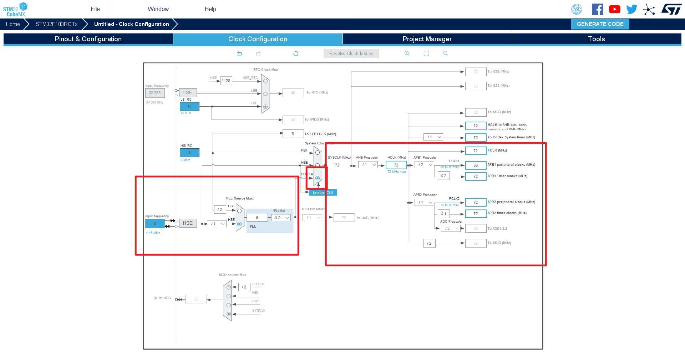

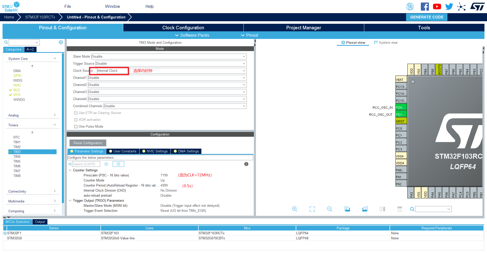

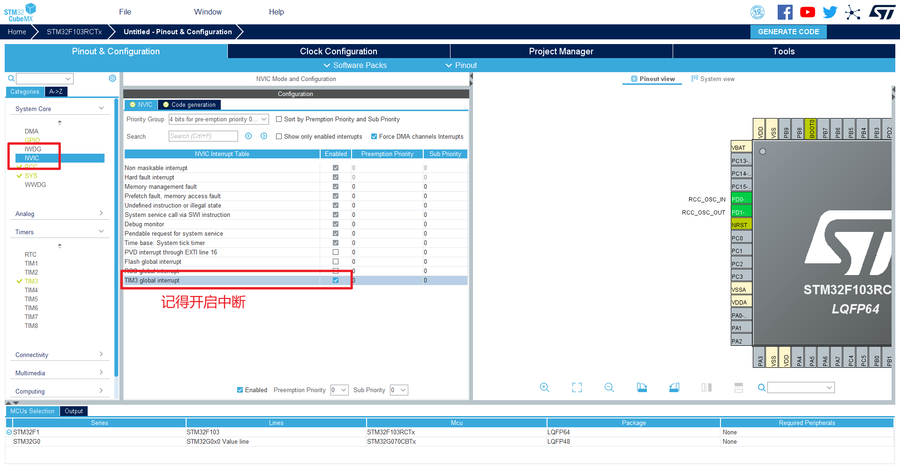

TIMER整体实现都是中断实现的。所以都是要开启NVIC的！

接下来打开工程文件，在初始化中开启定时器中断（要手动开）。

首先，先取消禁用sw。

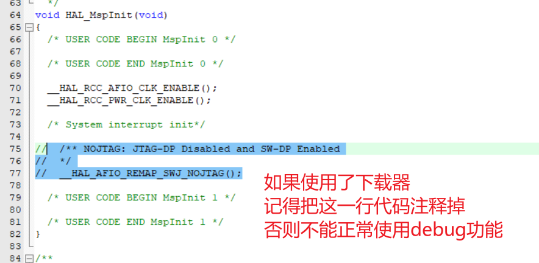

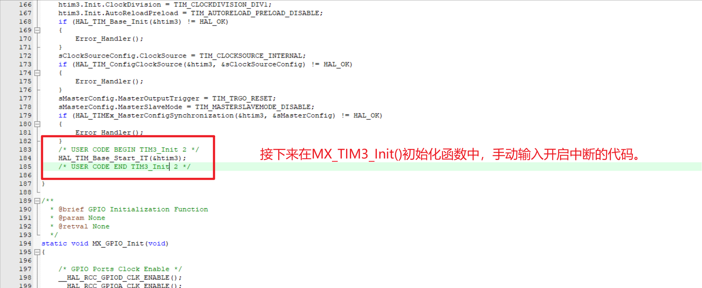

编写中断的Callback：

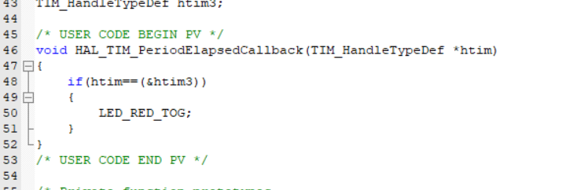

### 实现实验TIMLED的功能

开启usatr1和usart2。

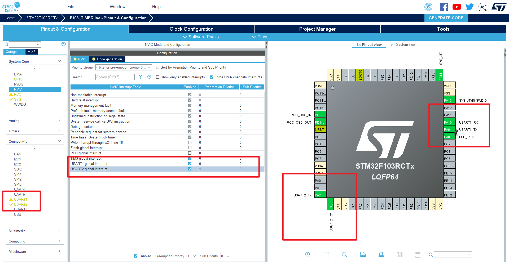

将之前的`IO.h/IO.c`放入工程内。

然后结合`4.4 UARTPostman`工程，将uart1和uart2的中断开启。

将Callback函数复制过来。

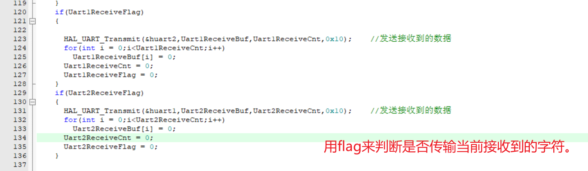

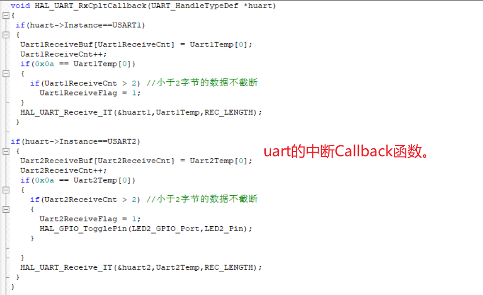

下载、调试。

### 实现定时器截断串口数据

#### 预期实验现象

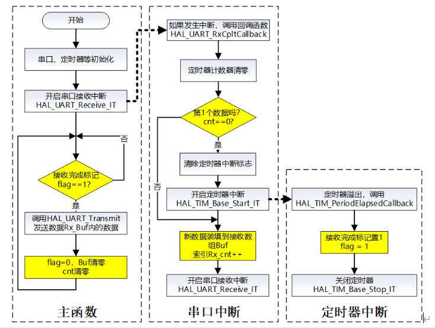

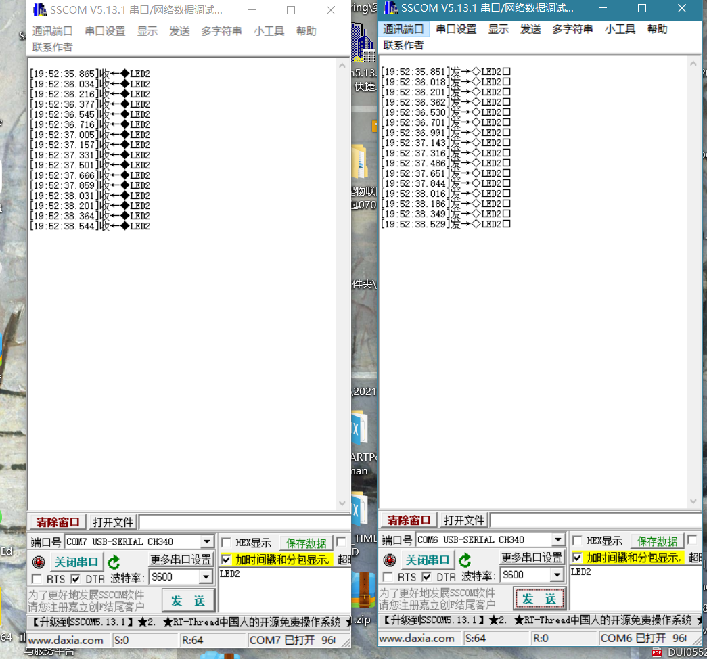

- 给usart2发送数据，从uart1端收数据；
- 可以发送任意长、任意格式、任意尾符号的数据。

#### 设计原理

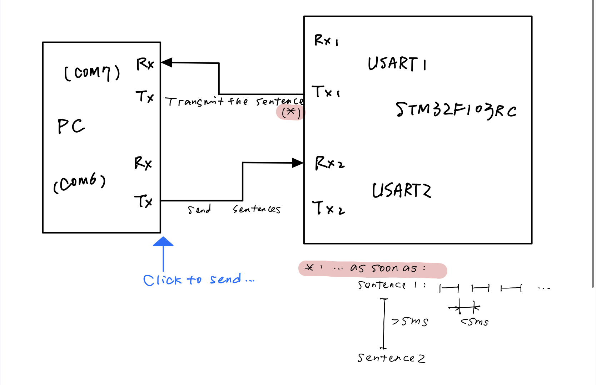

简而言之，当串口通信连续发送字节时：
- 如果两个字节之间的时间间隔＜某时间间隔：
    - 认定为同一句话；
- 如果当前字节与前一字节之间时间间隔＞某时间间隔：
    - 认定为两句话，前一句话通过uart发送。

也可以使用以同一个COM口。为了能够单独调试，使用了两个COM口。

#### 程序配置与源码

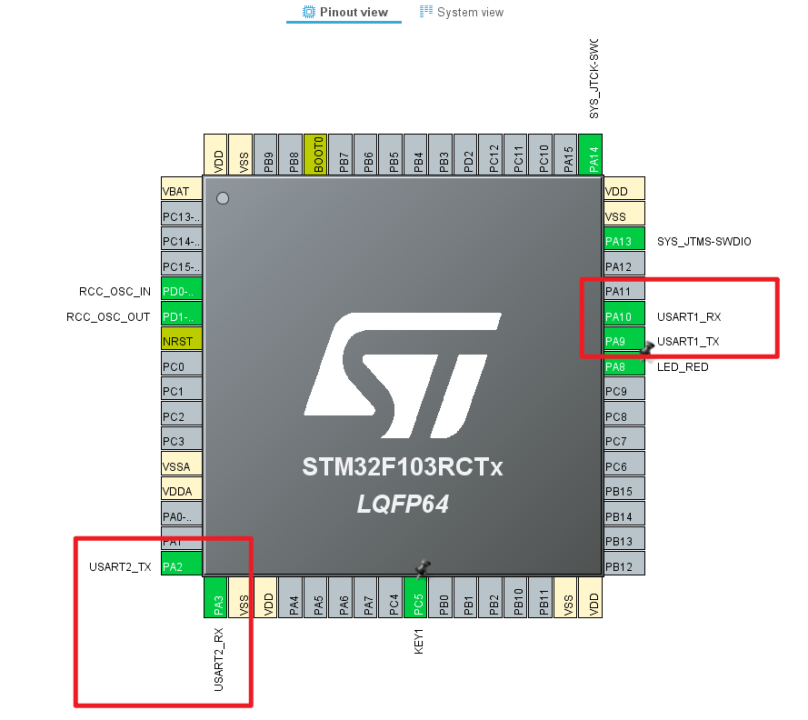

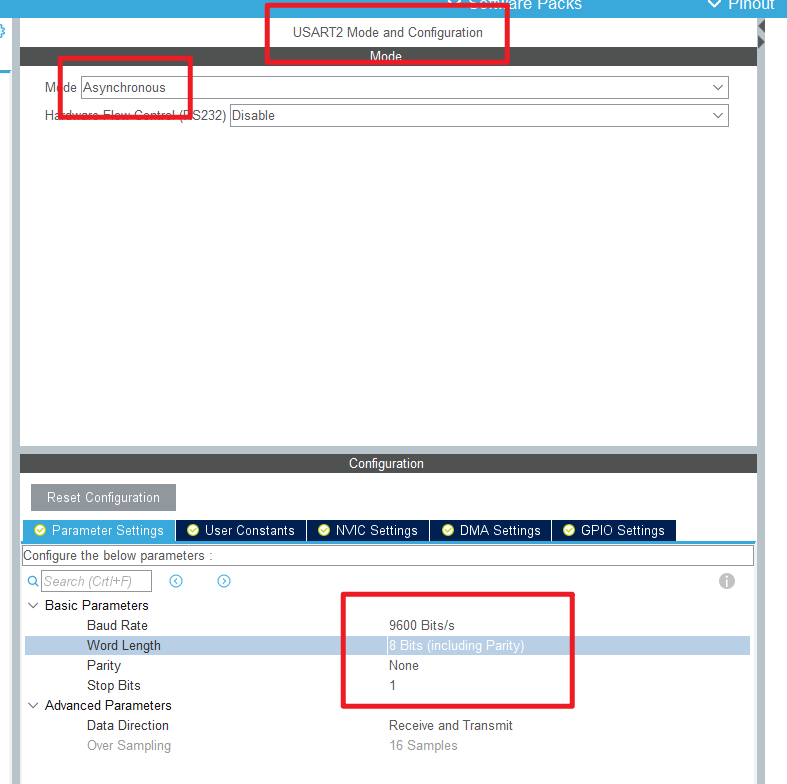

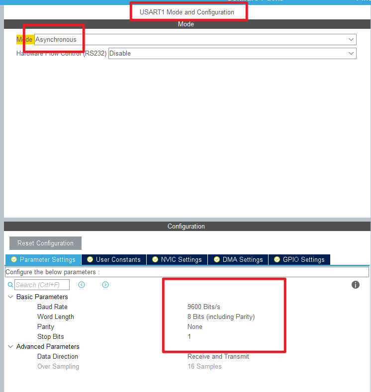

- TIMER设置

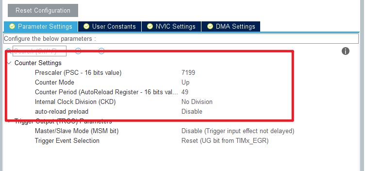

- 源码

定时器的Callback

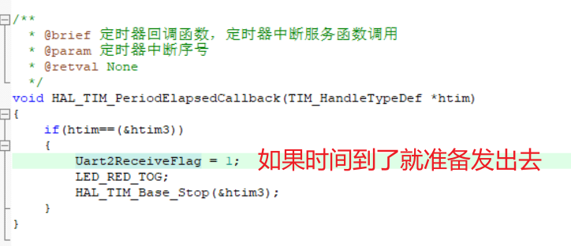

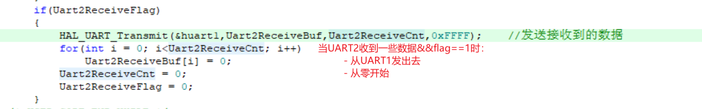

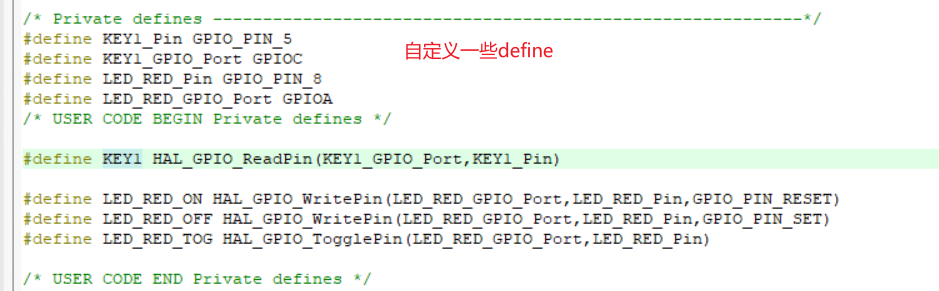

#### 实验现象

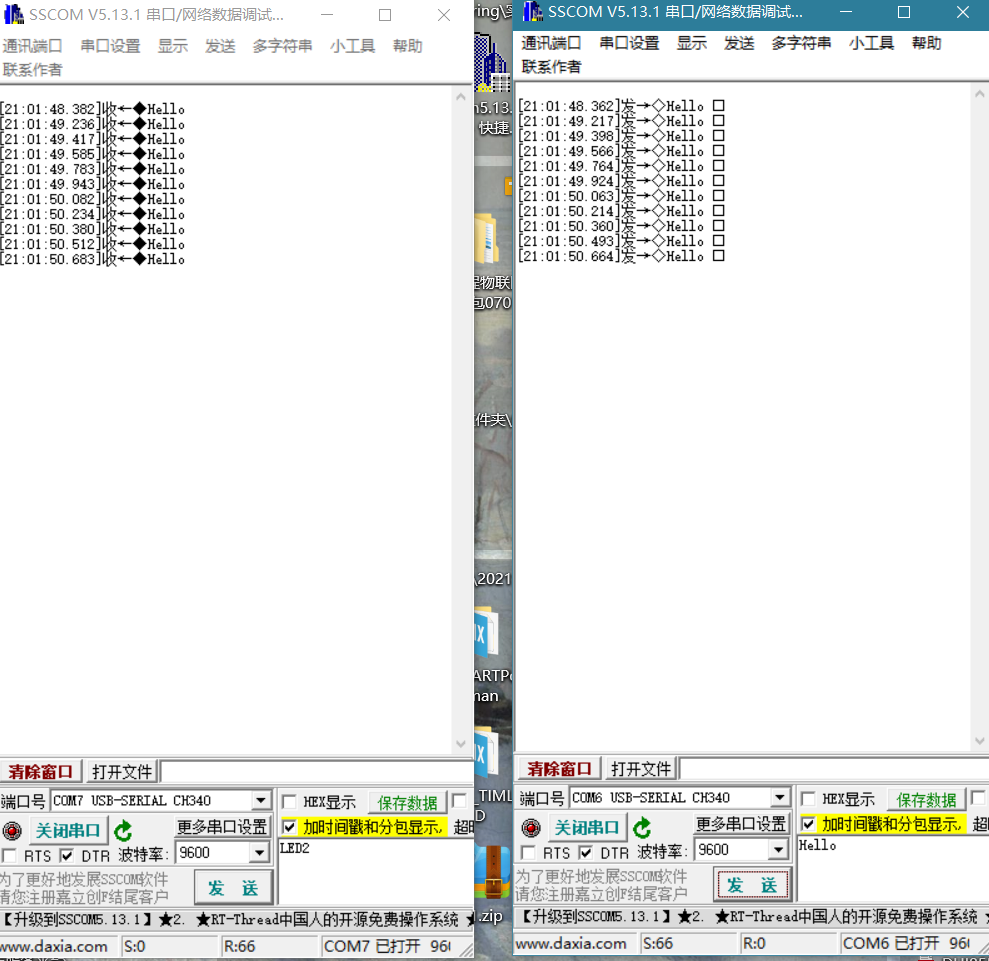

随着数据的发送，红灯电平翻转。
