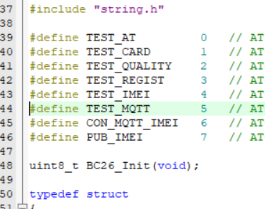
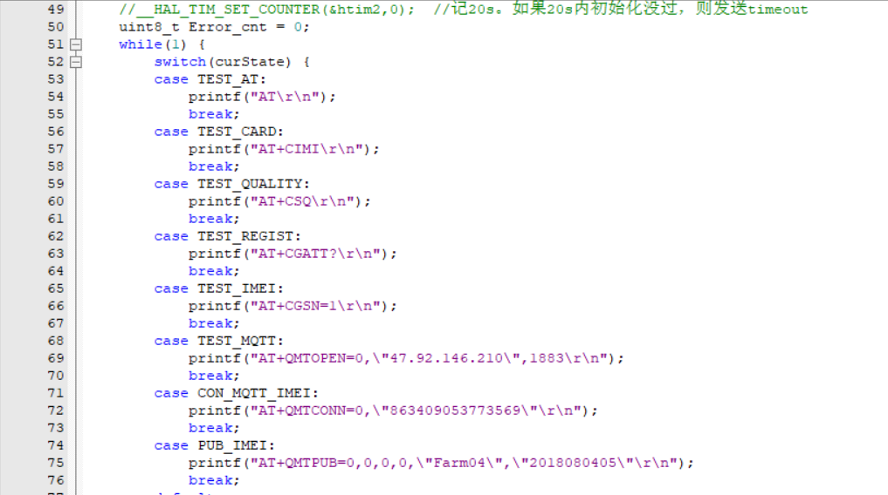
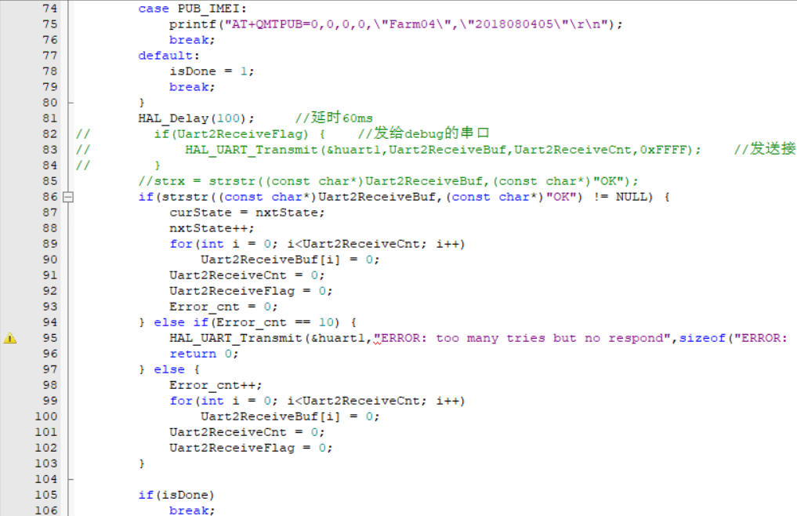
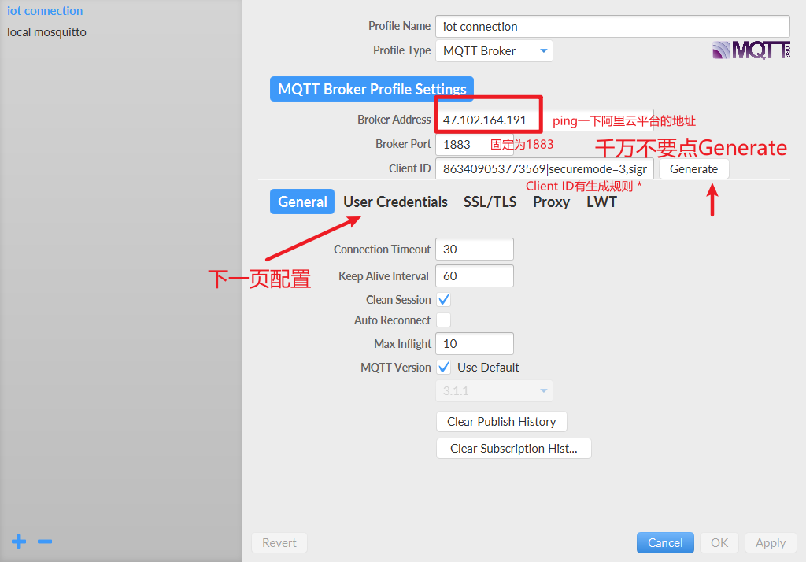
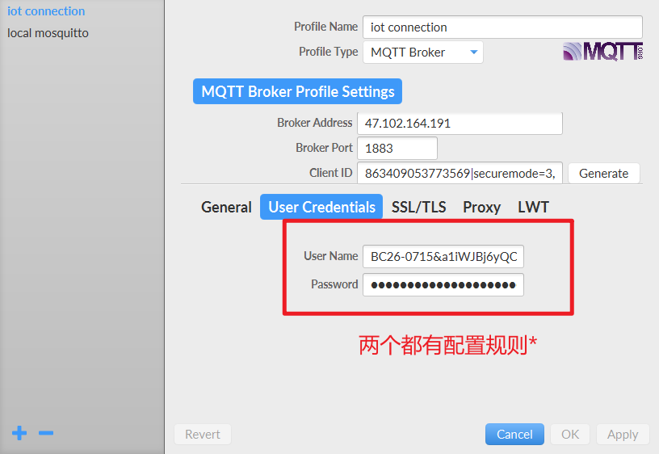
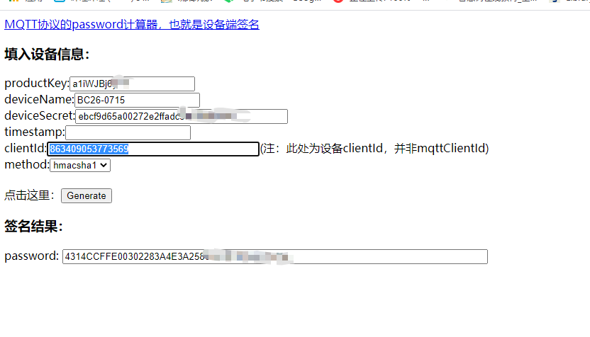
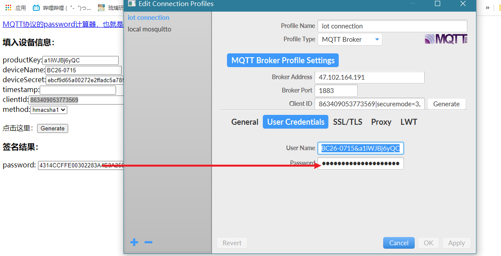
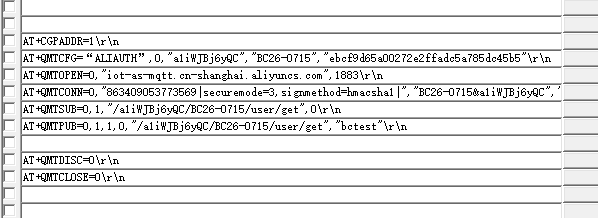
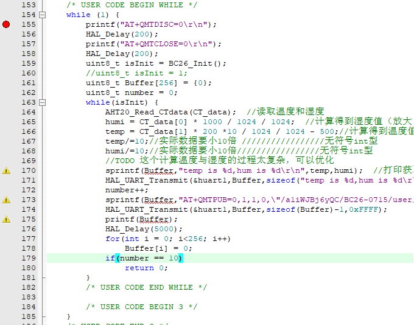

# day9

## 今日工作
1. 写BC26的状态机和初始化代码

2. 与阿里云平台连接（使用MQTT的方式）

3. 和队友写好的AHT20配合上报数据

### BC26的状态机和初始化代码

先定义一些状态

然后可以使用`switch`语句写SVM，比如这样：

中间遇到了一些问题，包括但不仅限于：
- 奇怪的#define语句error
    - 因为头文件的包含关系；调整了头文件的include之后error消失。

### 阿里云和MQTT.fx的通信

- 用MQTT.fx模拟BC26上报数据

[使用MQTT.fx接入物联网平台](https://help.aliyun.com/document_detail/86706.html?spm=a2c4g.11174283.2.52.3a8b4c07qw6iQ4#h2-url-1)

因为想要尝试加密MQTT，所以略显复杂。

- Client ID配置规则：

固定格式：`${ClientID}|securemode=${Mode},signmethod=${SignMethod}|`

- ${ClientID}: 设备、App或Web等场景下的Client ID信息，可自定义，长度在64个字符以内。多数情况下为设备的ID信息，建议使用您设备的MAC地址或SN码.
    - 在平台上设置的时候其实已经填过了。大部分都填的是BC26的IMEI号。
- ${Mode}：安全模式。
    - securemode=3：TCP直连模式，无需设置SSL/TLS信息。
    - securemode=2：TLS直连模式，需要设置SSL/TLS信息。
    - 我选择了TCP。可以省去配置SSL的步骤。

- ${SignMethod}：算法类型，支持hmacmd5和hmacsha1。
    - 要记录一下；一位内后面生成password 的时候要用到。不同的算法，出来的格式都不同。

比如说，此次配置我的Client ID为：

`863409053773569|securemode=3,signmethod=hmacsha1|`

- User Name: 固定格式：`${DeviceName}&${ProductKey}`
    - ProductKey在产品详情里面可以看到。

例如我的User Name：
`BC26-0715&a1iWJBj6yQC`

- Password: 用工具生成密码。
    - productKey、deviceName、deviceSecret：设备证书信息。可在控制台设备详情页查看。
    - timestamp：（可选）时间戳。
    - clientId：设备的ID信息，与MQTT.fx的Client ID中${clientId}一致。
    - method：选择签名算法类型，与MQTT.fx的Client ID中${SignMethod}一致。

我的密码配置界面：

接下来就用MQTT.fx测试即可。步骤同前。

### BC26与阿里云平台的连接

将刚刚配置好的ID和密码记录，放入AT指令之中即可。

### 使用STM32和BC26上报数据

发送10次：

