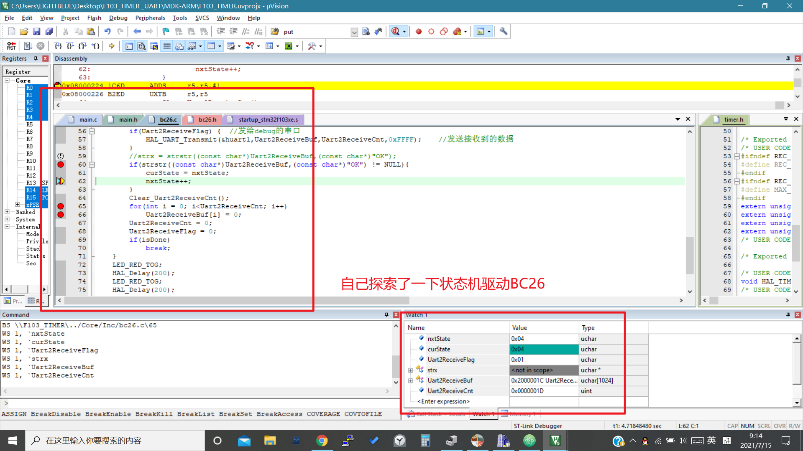
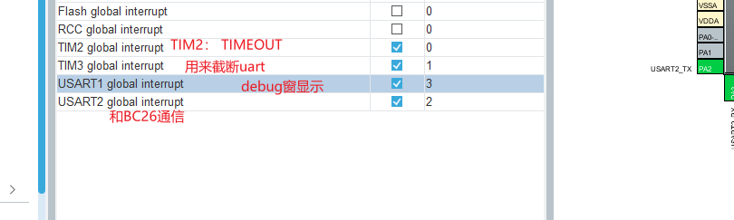
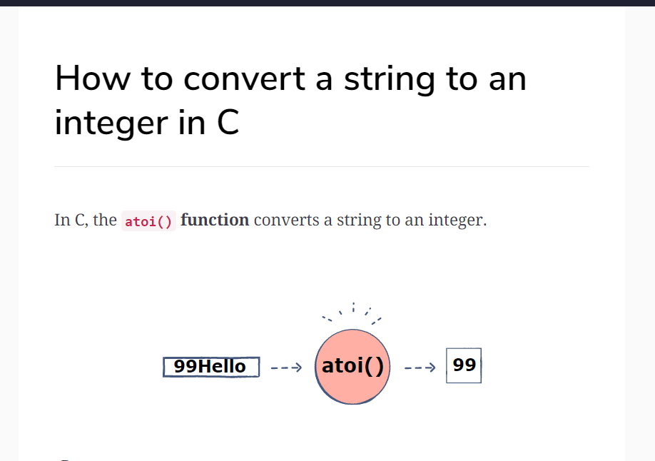

# day9

## 今日计划


## 和BC26的通信

- 配置



- 需要用到的方法




[How to convert a string to an integer in C](https://www.educative.io/edpresso/how-to-convert-a-string-to-an-integer-in-c)

```C
int atoi(const char *string)
```

```C
#include<stdio.h>
#include <stdlib.h>

int main() {
    // Converting a numeric string
    char str[10] = "122";
    int x = atoi(str);
    printf("Converting '122': %d\n", x);

    // Converting an alphanumeric string
    char str2[10] = "Hello!";
    x = atoi(str2);
    printf("Converting 'Hello!': %d\n", x);

    // Converting a partial string
    char str3[10] = "99Hello!";
    x = atoi(str3);
    printf("Converting '99Hello!': %d\n", x);
    return 0;
}
```
